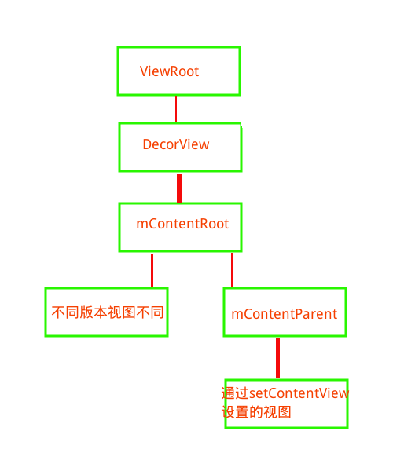
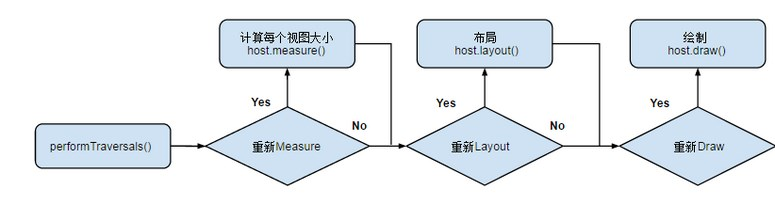
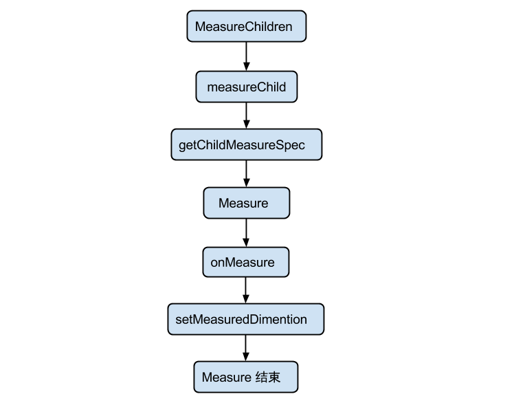

## 基础知识

view的绘制流程,基于7.0源码的分析。

### SetContent对绘制的触发流程

绘制的触发，一般有几种情况，这里先看setContentView引起的绘制方式。

在activity中调用该方法，如下：

	public void setContentView(@LayoutRes int layoutResID) {   
	  getWindow().setContentView(layoutResID);   
	  . . .
	}

也就走到了phoneWindow的方法中：

    public void setContentView(int layoutResID) {
        if(this.mContentParent == null) {
			//初始化decorView
            this.installDecor();
        } else if(!this.hasFeature(12)) {
            this.mContentParent.removeAllViews();
        }

        if(this.hasFeature(12)) {
            Scene cb = Scene.getSceneForLayout(this.mContentParent, layoutResID, this.getContext());
            this.transitionTo(cb);
        } else {
			//构建view树
            this.mLayoutInflater.inflate(layoutResID, this.mContentParent);
        }

        this.mContentParent.requestApplyInsets();
        android.view.Window.Callback cb1 = this.getCallback();
        if(cb1 != null && !this.isDestroyed()) {
            cb1.onContentChanged();
        }

        this.mContentParentExplicitlySet = true;
    }　

在该方法中this.installDecor()初始化了decorView，installDecor中又调用了代码如下(this代表phoneWindow)：

	this.mContentParent = this.generateLayout(this.mDecor);
	ViewGroup contentParent1 = (ViewGroup)this.findViewById(16908290);

可以看到，这里的contentParent是find出来的，说明，上一句的generateLayout中，加载了布局，布局中有contentParent

果然在generateLayout(this.mDecor)方法中加载了decorView的布局，值得注意的是，这里的布局id--layoutResource，并非固定的，而是根据情况改变的，例如是否有actionBar，是否是浮动样式的window(例如dialog样式的activity等)，在调用onResourcesLoaded之前，会对这些情况做判断，并选择相应的layoutResource，所以，可以可以看出为什么在代码中必须要在setContentView(...)之前才能执行requestWindowFeature(...)，因为这样才能选取出正确的decorView的rootView。rootView的布局，一般来说是一个FrameLayout或者linearLayout，里面有一个FrameLayout的ContentView，还有其他的例如actionbar之类的同级控件。

	protected ViewGroup generateLayout(DecorView decor) {
	...
	//加载decorview的布局
	this.mDecor.onResourcesLoaded(this.mLayoutInflater, layoutResource);
	...
	｝

在decorView的布局加载方法onResourcesLoaded中加载了Conentroot，并且将其添加到了index==0的位置，成为了decorView的直接根View：

	void onResourcesLoaded(LayoutInflater inflater, int layoutResource) {
        ....
	//初始化ContentRoot
        View root = inflater.inflate(layoutResource, (ViewGroup)null);
        if(this.mDecorCaptionView != null) {
            if(this.mDecorCaptionView.getParent() == null) {
                this.addView(this.mDecorCaptionView, new android.view.ViewGroup.LayoutParams(-1, -1));
            }

            this.mDecorCaptionView.addView(root, new MarginLayoutParams(-1, -1));
        } else {
            this.addView(root, 0, new android.view.ViewGroup.LayoutParams(-1, -1));
        }
		//赋值ContentRoot
        this.mContentRoot = (ViewGroup)root;
        this.initializeElevation();
    }

由上面的分析可知，decorview包含一个contentRoot（一般为framelayout或者linearlayout）,contentroot中又包含了一些布局以及contentParent（id为content的framelyout）

到这里，setContentView方法调用的installDecor方法的任务完成，成功初始化了decorView，随后调用了LayoutInflater.inflate()方法，在该方法中，解析了xml，递归的将子view组装成为一个完整view树，等待被绘制。此时，view和view之间的层级关系已经被组织好，decorView也初始化完毕，但是还没有绘制到屏幕上。因为decorView还没有添加到window中。

这里的viewRoot，其实对应的是ViewRootImpl，他并不是一个view，既不是view的父类也不是子类，他是viewParent，在这里，它并不是视图上的父控件，实际上，他负责处理View绘制流程的3个阶段（measure，layout，draw），以及一些事件分发。他只是名义上的parent，因为他确实负责view的绘制和事件分发工作，但是他不在视图上显示，也不被绘制，相当于是一个逻辑抽象的控制器。

那么ViewRootImpl是如何开始绘制的呢，我们在前面说了视图树的组装以及decorview的初始化已经在setContentView中完成，下面开始说绘制。

绘制过程的发起，在ActivityThread#handleLaunchActivity中启动Activity，在这里面会调用到Activity#onCreate方法，从而完成上面所述的DecorView创建动作，当onCreate()方法执行完毕，在handleLaunchActivity方法会继续调用到ActivityThread#handleResumeActivity方法：

	final void handleResumeActivity(IBinder token, boolean clearHide, boolean isForward) { 
	...
     if (a.mVisibleFromClient && !a.mWindowAdded) {
                    a.mWindowAdded = true;
                    wm.addView(decor, l);
                }
	...

    }
	

在该方法中，WindowManager调用了addview，添加了decorvie），以及LayoutParams,addView中调用的WindowManagerImpl的addView方法：

    public void addView(View view, LayoutParams params) {
        SeempLog.record_vg_layout(383, params);
        this.applyDefaultToken(params);
        this.mGlobal.addView(view, params, this.mContext.getDisplay(), this.mParentWindow);
    }

最后来到了WindowManagerGlobal的addview方法：

	public void addView(View view, ViewGroup.LayoutParams params,
            Display display, Window parentWindow) {
        if (view == null) {
            throw new IllegalArgumentException("view must not be null");
        }
        if (display == null) {
            throw new IllegalArgumentException("display must not be null");
        }
        if (!(params instanceof WindowManager.LayoutParams)) {
            throw new IllegalArgumentException("Params must be WindowManager.LayoutParams");
        }

        final WindowManager.LayoutParams wparams = (WindowManager.LayoutParams) params;
        if (parentWindow != null) {
            parentWindow.adjustLayoutParamsForSubWindow(wparams);
        } else {
            // If there's no parent, then hardware acceleration for this view is
            // set from the application's hardware acceleration setting.
            final Context context = view.getContext();
            if (context != null
                    && (context.getApplicationInfo().flags
                            & ApplicationInfo.FLAG_HARDWARE_ACCELERATED) != 0) {
                wparams.flags |= WindowManager.LayoutParams.FLAG_HARDWARE_ACCELERATED;
            }
        }

        ViewRootImpl root;
        View panelParentView = null;

        synchronized (mLock) {
            // Start watching for system property changes.
            if (mSystemPropertyUpdater == null) {
                mSystemPropertyUpdater = new Runnable() {
                    @Override public void run() {
                        synchronized (mLock) {
                            for (int i = mRoots.size() - 1; i >= 0; --i) {
                                mRoots.get(i).loadSystemProperties();
                            }
                        }
                    }
                };
                SystemProperties.addChangeCallback(mSystemPropertyUpdater);
            }

            int index = findViewLocked(view, false);
            if (index >= 0) {
                if (mDyingViews.contains(view)) {
                    // Don't wait for MSG_DIE to make it's way through root's queue.
                    mRoots.get(index).doDie();
                } else {
                    throw new IllegalStateException("View " + view
                            + " has already been added to the window manager.");
                }
                // The previous removeView() had not completed executing. Now it has.
            }

            // If this is a panel window, then find the window it is being
            // attached to for future reference.
            if (wparams.type >= WindowManager.LayoutParams.FIRST_SUB_WINDOW &&
                    wparams.type <= WindowManager.LayoutParams.LAST_SUB_WINDOW) {
                final int count = mViews.size();
                for (int i = 0; i < count; i++) {
                    if (mRoots.get(i).mWindow.asBinder() == wparams.token) {
                        panelParentView = mViews.get(i);
                    }
                }
            }

			//关键点1
            root = new ViewRootImpl(view.getContext(), display);

            view.setLayoutParams(wparams);

            mViews.add(view);
            mRoots.add(root);
            mParams.add(wparams);
        }

        // do this last because it fires off messages to start doing things
        try {
			//关键点2
            root.setView(view, wparams, panelParentView);
        } catch (RuntimeException e) {
            // BadTokenException or InvalidDisplayException, clean up.
            synchronized (mLock) {
                final int index = findViewLocked(view, false);
                if (index >= 0) {
                    removeViewLocked(index, true);
                }
            }
            throw e;
        }
    }

看上面的关键点1，可以看到，root（ViewRootImpl）被 创建，随后在关键点2，root指定了view（decorView），从而使得ViewRootImpl持有了decorView，这样ViewRootImpl就可以控制decorView，就具备了ViewRootImpl负责绘制的基本条件。

在上诉的关键点2中，setView的调用进入了ViewRootImpl的setView中，在这个方法中，会调用ViewRootImpl的requestLayout方法，如下：

    @Override
    public void requestLayout() {
        if (!mHandlingLayoutInLayoutRequest) {
            checkThread();
            mLayoutRequested = true;
            scheduleTraversals();
        }
    }

scheduleTraversals方法会向主线程发送一个“遍历”消息，最终会导致ViewRootImpl的performTraversals()方法被调用。下面，我们以performTraversals()为起点，来分析View的整个绘制流程。

	private void performTraversals() {
	        // cache mView since it is used so much below...
	        //我们在Step3知道，mView就是DecorView根布局
	        final View host = mView;
	        //在Step3 成员变量mAdded赋值为true，因此条件不成立
	        if (host == null || !mAdded)
	            return;
	        //是否正在遍历
	        mIsInTraversal = true;
	        //是否马上绘制View
	        mWillDrawSoon = true;
	
	        .............
	        //顶层视图DecorView所需要窗口的宽度和高度
	        int desiredWindowWidth;
	        int desiredWindowHeight;
	
	        .....................
	        //在构造方法中mFirst已经设置为true，表示是否是第一次绘制DecorView
	        if (mFirst) {
	            mFullRedrawNeeded = true;
	            mLayoutRequested = true;
	            //如果窗口的类型是有状态栏的，那么顶层视图DecorView所需要窗口的宽度和高度就是除了状态栏
	            if (lp.type == WindowManager.LayoutParams.TYPE_STATUS_BAR_PANEL
	                    || lp.type == WindowManager.LayoutParams.TYPE_INPUT_METHOD) {
	                // NOTE -- system code, won't try to do compat mode.
	                Point size = new Point();
	                mDisplay.getRealSize(size);
	                desiredWindowWidth = size.x;
	                desiredWindowHeight = size.y;
	            } else {//否则顶层视图DecorView所需要窗口的宽度和高度就是整个屏幕的宽高
	                DisplayMetrics packageMetrics =
	                    mView.getContext().getResources().getDisplayMetrics();
	                desiredWindowWidth = packageMetrics.widthPixels;
	                desiredWindowHeight = packageMetrics.heightPixels;
	            }
	    }
	............
	//获得view宽高的测量规格，mWidth和mHeight表示窗口的宽高，lp.widthhe和lp.height表示DecorView根布局宽和高
	 int childWidthMeasureSpec = getRootMeasureSpec(mWidth, lp.width);
	 int childHeightMeasureSpec = getRootMeasureSpec(mHeight, lp.height);
	
	  // Ask host how big it wants to be
	  //执行测量操作
	  performMeasure(childWidthMeasureSpec, childHeightMeasureSpec);
	
	........................
	//执行布局操作
	 performLayout(lp, desiredWindowWidth, desiredWindowHeight);
	
	.......................
	//执行绘制操作
	performDraw();
	
	}

在上面的代码可以看到，里面有performMeasure开启了measure，有performLayout开启了layout，有performDraw开启了draw。

到这里我们总结一下目前的流程：

总的来说，在ActivityThread的handleResumeActivity方法中，wm.addView将decorView添加到了windowmanager的Views列表中，并且将decorView添加到了root（ViewRootImpl）中，随后开始调用了ViewRootImpl的requestLayout方法，开启了绘制。

### 绘制的三个阶段

绘制有三个阶段，计算大小，布局，绘制。

- measure: 判断是否需要重新计算View的大小，需要的话则计算；

- layout: 判断是否需要重新计算View的位置，需要的话则计算；

- draw: 判断是否需要重新绘制View，需要的话则重绘制。

值得注意的是：用户主动调用 request，只会触发 measure 和 layout 过程，而不会执行 draw 过程

#### 1 measure 

measure的 核心方法有如下3个

- measure(int widthMeasureSpec, int heightMeasureSpec)
该方法定义在View.java类中，为 final 类型，不可被复写，但 measure 调用链最终会回调 View/ViewGroup 对象的 onMeasure()方法，因此自定义视图时，只需要复写 onMeasure() 方法即可。

- onMeasure(int widthMeasureSpec, int heightMeasureSpec)
该方法就是我们自定义视图中实现测量逻辑的方法，该方法的参数是父视图对子视图的 width 和 height 的测量要求。在我们自身的自定义视图中，要做的就是根据该 widthMeasureSpec 和 heightMeasureSpec 计算视图的 width 和 height，不同的模式处理方式不同。

- setMeasuredDimension()
测量阶段终极方法，在 onMeasure(int widthMeasureSpec, int heightMeasureSpec) 方法中调用，将计算得到的尺寸，传递给该方法，测量阶段即结束。该方法也是必须要调用的方法，否则会报异常。在我们在自定义视图的时候，不需要关心系统复杂的 Measure 过程的，只需调用setMeasuredDimension()设置根据 MeasureSpec 计算得到的尺寸即可，你可以参考 ViewPagerIndicator 的 onMeasure 方法。

在performTraversals方法中，调用了如下方法measureHierarchy：

	private boolean measureHierarchy(final View host, final WindowManager.LayoutParams lp, final Resources res,final int desiredWindowWidth, final int desiredWindowHeight) {
		  // 传入的desiredWindowXxx为窗口尺寸
		  int childWidthMeasureSpec;
		  int childHeightMeasureSpec;
		  boolean windowSizeMayChange = false;
		  . . .
		  boolean goodMeasure = false;
		 
		  if (!goodMeasure) {
	    childWidthMeasureSpec = getRootMeasureSpec(desiredWindowWidth, lp.width);
	    childHeightMeasureSpec = getRootMeasureSpec(desiredWindowHeight, lp.height);
		//开始measure
	    performMeasure(childWidthMeasureSpec, childHeightMeasureSpec);
	 
	    if (mWidth != host.getMeasuredWidth() || mHeight != host.getMeasuredHeight()) {
	      windowSizeMayChange = true;
    }	
	  }
	  return windowSizeMayChange;
	}

上面的代码中调用getRootMeasureSpec()方法来获取根MeasureSpec，这个根MeasureSpec代表了对decorView的宽高的约束信息。继续分析之前，我们先来简单地介绍下MeasureSpec的概念。
MeasureSpec是一个32位整数，由SpecMode和SpecSize两部分组成，其中，高2位为SpecMode，低30位为SpecSize。SpecMode为测量模式，SpecSize为相应测量模式下的测量尺寸。View（包括普通View和ViewGroup）的SpecMode由本View的LayoutParams结合父View的MeasureSpec生成。
SpecMode的取值可为以下三种：

EXACTLY: 对子View提出了一个确切的建议尺寸（SpecSize）；
AT_MOST: 子View的大小不得超过SpecSize；
UNSPECIFIED: 对子View的尺寸不作限制，通常用于系统内部。
传入performMeasure()方法的MeasureSpec的SpecMode为EXACTLY，SpecSize为窗口尺寸。

performMeasure()方法的源码如下：

	private void performMeasure(int childWidthMeasureSpec, int childHeightMeasureSpec) {
	  . . .
	  try {
		//关键
	    mView.measure(childWidthMeasureSpec, childHeightMeasureSpec);
	  } finally {
	    . . .
	  }
	}

这里的关键点，mView就是之前赋值给viewRootImpl的decorView，这里调用了measure方法：

	/**
	 * 调用这个方法来算出一个View应该为多大。参数为父View对其宽高的约束信息。
	 * 实际的测量工作在onMeasure()方法中进行
	 */
	public final void measure(int widthMeasureSpec, int heightMeasureSpec) {
	  . . .
	  // 判断是否需要重新布局
	 
	  // 若mPrivateFlags中包含PFLAG_FORCE_LAYOUT标记，则强制重新布局
	  // 比如调用View.requestLayout()会在mPrivateFlags中加入此标记
	  final boolean forceLayout = (mPrivateFlags & PFLAG_FORCE_LAYOUT) == PFLAG_FORCE_LAYOUT;
	  final boolean specChanged = widthMeasureSpec != mOldWidthMeasureSpec
	      || heightMeasureSpec != mOldHeightMeasureSpec;
	  final boolean isSpecExactly = MeasureSpec.getMode(widthMeasureSpec) == MeasureSpec.EXACTLY
	      && MeasureSpec.getMode(heightMeasureSpec) == MeasureSpec.EXACTLY;
	  final boolean matchesSpecSize = getMeasuredWidth() == MeasureSpec.getSize(widthMeasureSpec)
	      && getMeasuredHeight() == MeasureSpec.getSize(heightMeasureSpec);
	  final boolean needsLayout = specChanged
	      && (sAlwaysRemeasureExactly || !isSpecExactly || !matchesSpecSize);
	 
	  // 需要重新布局 
	  if (forceLayout || needsLayout) {
	    . . .
	    // 先尝试从缓从中获取，若forceLayout为true或是缓存中不存在或是
	    // 忽略缓存，则调用onMeasure()重新进行测量工作
	    int cacheIndex = forceLayout ? -1 : mMeasureCache.indexOfKey(key);
	    if (cacheIndex < 0 || sIgnoreMeasureCache) {
	      // measure ourselves, this should set the measured dimension flag back
	      onMeasure(widthMeasureSpec, heightMeasureSpec);
	      . . .
	    } else {
	      // 缓存命中，直接从缓存中取值即可，不必再测量
	      long value = mMeasureCache.valueAt(cacheIndex);
	      // Casting a long to int drops the high 32 bits, no mask needed
	      setMeasuredDimensionRaw((int) (value >> 32), (int) value);
	      . . .
	    }
	    . . .
	  }
	  mOldWidthMeasureSpec = widthMeasureSpec;
	  mOldHeightMeasureSpec = heightMeasureSpec;
	  mMeasureCache.put(key, ((long) mMeasuredWidth) << 32 |
	      (long) mMeasuredHeight & 0xffffffffL); // suppress sign extension
	}

从measure()方法的源码中我们可以知道，只有以下两种情况之一，才会进行实际的测量工作：

- forceLayout为true：这表示强制重新布局，可以通过View.requestLayout()来实现；

- needsLayout为true，这需要specChanged为true（表示本次传入的MeasureSpec与上次传入的不同），并且以下三个条件之一成立：
	
	1 sAlwaysRemeasureExactly为true: 表示是否需要总是重新测量指定大小的情况

	2 isSpecExactly为false: 说明传入的大小不为固定大小，则需要测量来判断实际大小
	
	3 matchesSpecSize为false: 表示父View的宽高尺寸要求与上次测量的结果不同

如果需要测量，则进入onMeasure方法，由于decorview实际是frameLayout或者linearLayout，大多数情况下是framelayout，所以这里我们看一下frameLayout的onMeasure。

对于decorView来说，实际执行测量工作的是FrameLayout的onMeasure()方法，该方法的源码如下：

	@Override
	protected void onMeasure(int widthMeasureSpec, int heightMeasureSpec) {
	  int count = getChildCount();
	  . . .
	  int maxHeight = 0;
	  int maxWidth = 0;
	 
	  int childState = 0;
	  for (int i = 0; i < count; i++) {
	    final View child = getChildAt(i);
	    if (mMeasureAllChildren || child.getVisibility() != GONE) {
		//测量子控件
	      measureChildWithMargins(child, widthMeasureSpec, 0, heightMeasureSpec, 0);
	      final LayoutParams lp = (LayoutParams) child.getLayoutParams();
	      maxWidth = Math.max(maxWidth,
	          child.getMeasuredWidth() + lp.leftMargin + lp.rightMargin);
	      maxHeight = Math.max(maxHeight,
	          child.getMeasuredHeight() + lp.topMargin + lp.bottomMargin);
	      childState = combineMeasuredStates(childState, child.getMeasuredState());
	 
	      . . .
	    }
	  }
	 
	  // Account for padding too
	  maxWidth += getPaddingLeftWithForeground() + getPaddingRightWithForeground();
	  maxHeight += getPaddingTopWithForeground() + getPaddingBottomWithForeground();
	 
	  // Check against our minimum height and width
	  maxHeight = Math.max(maxHeight, getSuggestedMinimumHeight());
	  maxWidth = Math.max(maxWidth, getSuggestedMinimumWidth());
	 
	  // Check against our foreground's minimum height and width
	  final Drawable drawable = getForeground();
	  if (drawable != null) {
	    maxHeight = Math.max(maxHeight, drawable.getMinimumHeight());
	    maxWidth = Math.max(maxWidth, drawable.getMinimumWidth());
	  }
	 //终极方法
	  setMeasuredDimension(resolveSizeAndState(maxWidth, widthMeasureSpec, childState),
	        resolveSizeAndState(maxHeight, heightMeasureSpec,
	        childState << MEASURED_HEIGHT_STATE_SHIFT));
	  . . .
	}

其中循环的调用measureChildWithMargins方法，在measureChildWithMargins方法中，又调用child.measure方法来测量每个child，本质上，是一个递归调用的过程，计算出每个child的宽高以后，在比较出最大的宽高，这就是子view需要的宽高了。

然后再看当前view是否设置了最小宽高，如果设置了，那么还要将子view的最大宽高和当前view的最小值进行对比，取最大的值作为预备宽高。这个值的意义是，只要以这个值展示当前view，那么包含的所有子view就能被满足。

随后在调用终极方法setMeasuredDimension设置测量完成的大小时，做了最后的resolveSizeAndState方法，这里面我们看源码：

	public static int resolveSizeAndState(int size, int measureSpec, int childMeasuredState) {
	        final int specMode = MeasureSpec.getMode(measureSpec);
	        final int specSize = MeasureSpec.getSize(measureSpec);
	        final int result;
	        switch (specMode) {
	            case MeasureSpec.AT_MOST:
	                if (specSize < size) {
	                    result = specSize | MEASURED_STATE_TOO_SMALL;
	                } else {
	                    result = size;
	                }
	                break;
	            case MeasureSpec.EXACTLY:
	                result = specSize;
	                break;
	            case MeasureSpec.UNSPECIFIED:
	            default:
	                result = size;
	        }
	        return result | (childMeasuredState & MEASURED_STATE_MASK);
	    }

可以看到，这里将预备大小和父控件传递给当前控件的测量要求（measureSpec）一起做了处理，也就是说，当前view的大小，其实是由子view和父view共同决定的。

那么这个父view是如何生成这个测量要求的呢，在上面我们说到，当前view会循环调用measureChildWithMargins，这个方法代码如下：

	protected void measureChildWithMargins(View child,
	  int parentWidthMeasureSpec, int widthUsed,
	  int parentHeightMeasureSpec, int heightUsed) {
	  final MarginLayoutParams lp = (MarginLayoutParams) child.getLayoutParams();
		//生成测量要求
	  final int childWidthMeasureSpec = getChildMeasureSpec(parentWidthMeasureSpec,
	      mPaddingLeft + mPaddingRight + lp.leftMargin + lp.rightMargin + widthUsed, lp.width);
	  final int childHeightMeasureSpec = getChildMeasureSpec(parentHeightMeasureSpec
	      mPaddingTop + mPaddingBottom + lp.topMargin + lp.bottomMargin + heightUsed, lp.height);
	 //开始子控件的测量
	  child.measure(childWidthMeasureSpec, childHeightMeasureSpec);
	 
	}

这个方法中，子控件的测量方法需要的参数，就是由当前控件提供，那么我们看下当前空间是如何生成这个测量要求的，由于测量过程是个递归过程，解决了当前view的生成过程，也就基本解决了其他view的生成过程。

在这里，他是通过getChildMeasureSpec方法来生成的，所以我们看下这个方法的代码：

	// spec参数   表示父View的MeasureSpec
	// padding参数    父View的Padding+子View的Margin，父View的大小减去这些边距，才能精确算出
	//               子View的MeasureSpec的size
	// childDimension参数  表示该子View内部LayoutParams属性的值（lp.width或者lp.height）
	//                    可以是wrap_content、match_parent、一个精确指(an exactly size), 
	public static int getChildMeasureSpec(int spec, int padding, int childDimension) { 
    int specMode = MeasureSpec.getMode(spec);  //获得父View的mode 
    int specSize = MeasureSpec.getSize(spec);  //获得父View的大小 
 
		//父View的大小-自己的Padding+子View的Margin，得到值才是子View的大小。
    int size = Math.max(0, specSize - padding);  
 
    int resultSize = 0;    //初始化值，最后通过这个两个值生成子View的MeasureSpec
    int resultMode = 0;    //初始化值，最后通过这个两个值生成子View的MeasureSpec
 
    switch (specMode) { 
    // Parent has imposed an exact size on us 
    //1、父View是EXACTLY的 ！ 
    case MeasureSpec.EXACTLY:  
        //1.1、子View的width或height是个精确值 (an exactly size) 
        if (childDimension >= 0) {           
            resultSize = childDimension;         //size为精确值 
            resultMode = MeasureSpec.EXACTLY;    //mode为 EXACTLY 。 
        }  
        //1.2、子View的width或height为 MATCH_PARENT/FILL_PARENT  
        else if (childDimension == LayoutParams.MATCH_PARENT) { 
            // Child wants to be our size. So be it. 
            resultSize = size;                   //size为父视图大小 
            resultMode = MeasureSpec.EXACTLY;    //mode为 EXACTLY 。 
        }  
        //1.3、子View的width或height为 WRAP_CONTENT 
        else if (childDimension == LayoutParams.WRAP_CONTENT) { 
            // Child wants to determine its own size. It can't be 
            // bigger than us. 
            resultSize = size;                   //size为父视图大小 
            resultMode = MeasureSpec.AT_MOST;    //mode为AT_MOST 。 
        } 
        break; 
 
    // Parent has imposed a maximum size on us 
    //2、父View是AT_MOST的 ！     
    case MeasureSpec.AT_MOST: 
        //2.1、子View的width或height是个精确值 (an exactly size) 
        if (childDimension >= 0) { 
            // Child wants a specific size... so be it 
            resultSize = childDimension;        //size为精确值 
            resultMode = MeasureSpec.EXACTLY;   //mode为 EXACTLY 。 
        } 
        //2.2、子View的width或height为 MATCH_PARENT/FILL_PARENT 
        else if (childDimension == LayoutParams.MATCH_PARENT) { 
            // Child wants to be our size, but our size is not fixed. 
            // Constrain child to not be bigger than us. 
            resultSize = size;                  //size为父视图大小 
            resultMode = MeasureSpec.AT_MOST;   //mode为AT_MOST 
        } 
        //2.3、子View的width或height为 WRAP_CONTENT 
        else if (childDimension == LayoutParams.WRAP_CONTENT) { 
            // Child wants to determine its own size. It can't be 
            // bigger than us. 
            resultSize = size;                  //size为父视图大小 
            resultMode = MeasureSpec.AT_MOST;   //mode为AT_MOST 
        } 
        break; 
 
    // Parent asked to see how big we want to be 
    //3、父View是UNSPECIFIED的 ！ 
    case MeasureSpec.UNSPECIFIED: 
        //3.1、子View的width或height是个精确值 (an exactly size) 
        if (childDimension >= 0) { 
            // Child wants a specific size... let him have it 
            resultSize = childDimension;        //size为精确值 
            resultMode = MeasureSpec.EXACTLY;   //mode为 EXACTLY 
        } 
        //3.2、子View的width或height为 MATCH_PARENT/FILL_PARENT 
        else if (childDimension == LayoutParams.MATCH_PARENT) { 
            // Child wants to be our size... find out how big it should 
            // be 
            resultSize = 0;                        //size为0！ ,其值未定 
            resultMode = MeasureSpec.UNSPECIFIED;  //mode为 UNSPECIFIED 
        }  
        //3.3、子View的width或height为 WRAP_CONTENT 
        else if (childDimension == LayoutParams.WRAP_CONTENT) { 
            // Child wants to determine its own size.... find out how 
            // big it should be 
            resultSize = 0;                        //size为0! ，其值未定 
            resultMode = MeasureSpec.UNSPECIFIED;  //mode为 UNSPECIFIED 
        } 
        break; 
    } 
    //根据上面逻辑条件获取的mode和size构建MeasureSpec对象。 
    return MeasureSpec.makeMeasureSpec(resultSize, resultMode); 
	}

这样就生成了相应的measureSpec，其实这个原理不难，就是当前view的measureSpec和子view的layoutParams合并处理后得到了子view的measureSpec。

下面总结一下上面的代码逻辑：

- 如果父View的MeasureSpec 是EXACTLY，说明父View的大小是确切的，（确切的意思很好理解，如果一个View的MeasureSpec 是EXACTLY，那么它的size 是多大，最后展示到屏幕就一定是那么大）。

	1、如果子View 的layout_xxxx是MATCH_PARENT，父View的大小是确切，子View的大小又MATCH_PARENT（充满整个父View），那么子View的大小肯定是确切的，而且大小值就是父View的size。所以子View的size=父View的size，mode=EXACTLY
	
	2、如果子View 的layout_xxxx是WRAP_CONTENT，也就是子View的大小是根据自己的content 来决定的，但是子View的毕竟是子View，大小不能超过父View的大小，但是子View的是WRAP_CONTENT，我们还不知道具体子View的大小是多少，要等到child.measure(childWidthMeasureSpec, childHeightMeasureSpec) 调用的时候才去真正测量子View 自己content的大小（比如TextView wrap_content 的时候你要测量TextView content 的大小，也就是字符占用的大小，这个测量就是在child.measure(childWidthMeasureSpec, childHeightMeasureSpec)的时候，才能测出字符的大小，MeasureSpec 的意思就是假设你字符100px，但是MeasureSpec 要求最大的只能50px，这时候就要截掉了）。通过上述描述，子View MeasureSpec mode的应该是AT_MOST，而size 暂定父View的 size，表示的意思就是子View的大小没有不确切的值，子View的大小最大为父View的大小，不能超过父View的大小（这就是AT_MOST 的意思），然后这个MeasureSpec 做为子View measure方法 的参数，做为子View的大小的约束或者说是要求，有了这个MeasureSpec子View再实现自己的测量。
	
	3、如果如果子View 的layout_xxxx是确定的值（200dp），那么就更简单了，不管你父View的mode和size是什么，我都写死了就是200dp，那么控件最后展示就是就是200dp，不管我的父View有多大，也不管我自己的content 有多大，反正我就是这么大，所以这种情况MeasureSpec 的mode = EXACTLY 大小size=你在layout_xxxx 填的那个值。

- 如果父View的MeasureSpec 是AT_MOST，说明父View的大小是不确定，最大的大小是MeasureSpec 的size值，不能超过这个值。

	1、如果子View 的layout_xxxx是MATCH_PARENT，父View的大小是不确定（只知道最大只能多大），子View的大小MATCH_PARENT（充满整个父View），那么子View你即使充满父容器，你的大小也是不确定的，父View自己都确定不了自己的大小，你MATCH_PARENT你的大小肯定也不能确定的，所以子View的mode=AT_MOST，size=父View的size，也就是你在布局虽然写的是MATCH_PARENT，但是由于你的父容器自己的大小不确定，导致子View的大小也不确定，只知道最大就是父View的大小。
	
	2、如果子View 的layout_xxxx是WRAP_CONTENT，父View的大小是不确定（只知道最大只能多大），子View又是WRAP_CONTENT，那么在子View的Content没算出大小之前，子View的大小最大就是父View的大小，所以子View MeasureSpec mode的就是AT_MOST，而size 暂定父View的 size。
	
	3、如果如果子View 的layout_xxxx是确定的值（200dp），同上，写多少就是多少，改变不了的。

- 如果父View的MeasureSpec 是UNSPECIFIED(未指定),表示没有任何束缚和约束，不像AT_MOST表示最大只能多大，不也像EXACTLY表示父View确定的大小，子View可以得到任意想要的大小，不受约束

	1、如果子View 的layout_xxxx是MATCH_PARENT，因为父View的MeasureSpec是UNSPECIFIED，父View自己的大小并没有任何约束和要求，
	那么对于子View来说无论是WRAP_CONTENT还是MATCH_PARENT，子View也是没有任何束缚的，想多大就多大，没有不能超过多少的要求，一旦没有任何要求和约束，size的值就没有任何意义了，所以一般都直接设置成0
	
	2、同上...
	
	3、如果如果子View 的layout_xxxx是确定的值（200dp），同上，写多少就是多少，改变不了的（记住，只有设置的确切的值，那么无论怎么测量，大小都是不变的，都是你写的那个值）

了解了ViewGroup的测量，下面看一下view的测量，view的测量比较简单，它只需要测量好自己即可：

普通View的onMeasure方法如下：

	protected void onMeasure(int widthMeasureSpec, int heightMeasureSpec) {
	    setMeasuredDimension(getDefaultSize(getSuggestedMinimumWidth(), widthMeasureSpec),
	        getDefaultSize(getSuggestedMinimumHeight(), heightMeasureSpec));
	}

对于普通View（非ViewgGroup）来说，只需完成自身的测量工作即可。以上代码中通过setMeasuredDimension()方法设置测量的结果，具体来说是以getDefaultSize()方法的返回值来作为测量结果。getDefaultSize()方法的源码如下：

	public static int getDefaultSize(int size, int measureSpec) {
	  int result = size;
	  int specMode = MeasureSpec.getMode(measureSpec);
	  int specSize = MeasureSpec.getSize(measureSpec);
	  switch (specMode) {
	    case MeasureSpec.UNSPECIFIED:
	      result = size;
	      break;
	    case MeasureSpec.AT_MOST:
	    case MeasureSpec.EXACTLY:
	      result = specSize;
	      break;
	  }
	  return result;
	}

由上诉方法可知，如果为UNSPECIFIED，则大小为建议的最小大小，如果是另外的模式，那么大小就是父控件指定的大小。

到这里，整体的measure过程就完成了。

#### 2 layout

上面的measure过程，其实主要是确定view的大小，但是view的摆放过程中，view和父控件的相对位置也需要确定，layout就是为了确定view和父控件的相对位置。

	public void layout(int l, int t, int r, int b) {
        if ((mPrivateFlags3 & PFLAG3_MEASURE_NEEDED_BEFORE_LAYOUT) != 0) {
            onMeasure(mOldWidthMeasureSpec, mOldHeightMeasureSpec);
            mPrivateFlags3 &= ~PFLAG3_MEASURE_NEEDED_BEFORE_LAYOUT;
        }

        int oldL = mLeft;
        int oldT = mTop;
        int oldB = mBottom;
        int oldR = mRight;

		//关键点1 判断是否是视觉布局，采用不同的方法设置边距
        boolean changed = isLayoutModeOptical(mParent) ?
                setOpticalFrame(l, t, r, b) : setFrame(l, t, r, b);

        if (changed || (mPrivateFlags & PFLAG_LAYOUT_REQUIRED) == PFLAG_LAYOUT_REQUIRED) {
            //关键点2 onlayout
			onLayout(changed, l, t, r, b);
            mPrivateFlags &= ~PFLAG_LAYOUT_REQUIRED;

            ListenerInfo li = mListenerInfo;
            if (li != null && li.mOnLayoutChangeListeners != null) {
                ArrayList<OnLayoutChangeListener> listenersCopy =
                        (ArrayList<OnLayoutChangeListener>)li.mOnLayoutChangeListeners.clone();
                int numListeners = listenersCopy.size();
                for (int i = 0; i < numListeners; ++i) {
                    listenersCopy.get(i).onLayoutChange(this, l, t, r, b, oldL, oldT, oldR, oldB);
                }
            }
        }

        mPrivateFlags &= ~PFLAG_FORCE_LAYOUT;
        mPrivateFlags3 |= PFLAG3_IS_LAID_OUT;
    }	

在layout中，参数l，t，r，b分别代表了当前view距离父view左，上，右，下，四个边界的四个距离，在layout方法中关键点1可以看到，它判断了对齐方式，由于视觉对齐的话实际上的布局方式会有所改变。随后的setFrame方法就会设置当前view相对父view的四周边距，从而确定了相对位置。

layout的调用最终还是会走到onLayout中去，主要的layout步骤还是在onLayout中执行。

View的onLayout是空方法，没有实现，需要各个控件自己去实现，这里我们来看decorview作为Framelayout的时候的onLayout方法,可以看到，里面调用了layoutChildren方法，所以这里又贴出了layoutChildren方法源码。 

	 @Override
	    protected void onLayout(boolean changed, int left, int top, int right, int bottom) {
	        layoutChildren(left, top, right, bottom, false /* no force left gravity */);
	    }
	
	    void layoutChildren(int left, int top, int right, int bottom, boolean forceLeftGravity) {
	        final int count = getChildCount();
	
	        final int parentLeft = getPaddingLeftWithForeground();
	        final int parentRight = right - left - getPaddingRightWithForeground();
	
	        final int parentTop = getPaddingTopWithForeground();
	        final int parentBottom = bottom - top - getPaddingBottomWithForeground();
	
	        for (int i = 0; i < count; i++) {
	            final View child = getChildAt(i);
	            if (child.getVisibility() != GONE) {
	                final LayoutParams lp = (LayoutParams) child.getLayoutParams();
	
	                final int width = child.getMeasuredWidth();
	                final int height = child.getMeasuredHeight();
	
	                int childLeft;
	                int childTop;
	
	                int gravity = lp.gravity;
	                if (gravity == -1) {
	                    gravity = DEFAULT_CHILD_GRAVITY;
	                }
	
	                final int layoutDirection = getLayoutDirection();
	                final int absoluteGravity = Gravity.getAbsoluteGravity(gravity, layoutDirection);
	                final int verticalGravity = gravity & Gravity.VERTICAL_GRAVITY_MASK;
	
	                switch (absoluteGravity & Gravity.HORIZONTAL_GRAVITY_MASK) {
	                    case Gravity.CENTER_HORIZONTAL:
	                        childLeft = parentLeft + (parentRight - parentLeft - width) / 2 +
	                        lp.leftMargin - lp.rightMargin;
	                        break;
	                    case Gravity.RIGHT:
	                        if (!forceLeftGravity) {
	                            childLeft = parentRight - width - lp.rightMargin;
	                            break;
	                        }
	                    case Gravity.LEFT:
	                    default:
	                        childLeft = parentLeft + lp.leftMargin;
	                }
	
	                switch (verticalGravity) {
	                    case Gravity.TOP:
	                        childTop = parentTop + lp.topMargin;
	                        break;
	                    case Gravity.CENTER_VERTICAL:
	                        childTop = parentTop + (parentBottom - parentTop - height) / 2 +
	                        lp.topMargin - lp.bottomMargin;
	                        break;
	                    case Gravity.BOTTOM:
	                        childTop = parentBottom - height - lp.bottomMargin;
	                        break;
	                    default:
	                        childTop = parentTop + lp.topMargin;
	                }
	
	                child.layout(childLeft, childTop, childLeft + width, childTop + height);
	            }
	        }
	    }

layoutChildren方法中的parentLeft等，是当前控件作为的padding，随后与子view的margin处理后，生成了子控件相对于父控件的left距离，然后就调用了child.layout进入了子控件的layout过程。

所以整个layout过程是从decorview的layout发起，随后遍历递归的一个layout过程。

#### 3 draw

先看下与draw相关的函数

- View.draw(Canvas canvas)： 由于 ViewGroup 并没有复写此方法，因此，所有的视图最终都是调用 View 的 draw 方法进行绘制的。在自定义的视图中，也不应该复写该方法，而是复写 onDraw(Canvas) 方法进行绘制，如果自定义的视图确实要复写该方法，那么请先调用 super.draw(canvas)完成系统的绘制，然后再进行自定义的绘制。

- View.onDraw()：
View 的onDraw（Canvas）默认是空实现，自定义绘制过程需要复写的方法，绘制自身的内容。

- dispatchDraw() 发起对子视图的绘制。View 中默认是空实现，ViewGroup 复写了dispatchDraw()来对其子视图进行绘制。该方法我们不用去管，自定义的 ViewGroup 不应该对dispatchDraw()进行复写。

绘制流程如下：

前面我们说了在performTraversals方法中调用performDraw开启了draw，在performDraw里面，又调用了drawSoftware：

	private boolean drawSoftware(Surface surface, AttachInfo attachInfo, int xoff, int yoff,
            boolean scalingRequired, Rect dirty) {

        // Draw with software renderer.
        final Canvas canvas;
        try {
            //从surface对象中获得canvas变量
            canvas = mSurface.lockCanvas(dirty);

            // If this bitmap's format includes an alpha channel, we
            // need to clear it before drawing so that the child will
            // properly re-composite its drawing on a transparent
            // background. This automatically respects the clip/dirty region
            // or
            // If we are applying an offset, we need to clear the area
            // where the offset doesn't appear to avoid having garbage
            // left in the blank areas.
            if (!canvas.isOpaque() || yoff != 0 || xoff != 0) {
                canvas.drawColor(0, PorterDuff.Mode.CLEAR);
            }

           ......................

            try {
                //调整画布的位置
                canvas.translate(-xoff, -yoff);
                if (mTranslator != null) {
                    mTranslator.translateCanvas(canvas);
                }
                canvas.setScreenDensity(scalingRequired ? mNoncompatDensity : 0);
                attachInfo.mSetIgnoreDirtyState = false;
                //调用View类中的成员方法draw开始绘制View视图
                mView.draw(canvas);
            } 

        .....................

        return true;
    }

我们可以看到，这里先获得了canvas，随后传递给mView，这里我们前面讲到过，这里的mView其实就是decorView，由于DecorView本质上是一个FrameLayout或者linearLayout，那么我们就从FrameLayout的draw方法开始分析，由于framelayout没有自己实现draw方法，所以这里实际上是View的draw：

	public void draw(Canvas canvas) {
	        final int privateFlags = mPrivateFlags;
	        final boolean dirtyOpaque = (privateFlags & PFLAG_DIRTY_MASK) == PFLAG_DIRTY_OPAQUE &&
	                (mAttachInfo == null || !mAttachInfo.mIgnoreDirtyState);
	        mPrivateFlags = (privateFlags & ~PFLAG_DIRTY_MASK) | PFLAG_DRAWN;
	
	        /*
	         * Draw traversal performs several drawing steps which must be executed
	         * in the appropriate order:
	         *
	         *      1. Draw the background
	         *      2. If necessary, save the canvas' layers to prepare for fading
	         *      3. Draw view's content
	         *      4. Draw children
	         *      5. If necessary, draw the fading edges and restore layers
	         *      6. Draw decorations (scrollbars for instance)
	         */
	
	        // Step 1, draw the background, if needed
	        int saveCount;
	
	        if (!dirtyOpaque) {
	            drawBackground(canvas);
	        }
	
	        // skip step 2 & 5 if possible (common case)
	        final int viewFlags = mViewFlags;
	        boolean horizontalEdges = (viewFlags & FADING_EDGE_HORIZONTAL) != 0;
	        boolean verticalEdges = (viewFlags & FADING_EDGE_VERTICAL) != 0;
	        if (!verticalEdges && !horizontalEdges) {
	            // Step 3, draw the content
	            if (!dirtyOpaque) onDraw(canvas);
	
	            // Step 4, draw the children
	            dispatchDraw(canvas);
	
	            // Overlay is part of the content and draws beneath Foreground
	            if (mOverlay != null && !mOverlay.isEmpty()) {
	                mOverlay.getOverlayView().dispatchDraw(canvas);
	            }
	
	            // Step 6, draw decorations (foreground, scrollbars)
	            onDrawForeground(canvas);
	
	            // we're done...
	            return;
	        }
	
	        /*
	         * Here we do the full fledged routine...
	         * (this is an uncommon case where speed matters less,
	         * this is why we repeat some of the tests that have been
	         * done above)
	         */
	
	        boolean drawTop = false;
	        boolean drawBottom = false;
	        boolean drawLeft = false;
	        boolean drawRight = false;
	
	        float topFadeStrength = 0.0f;
	        float bottomFadeStrength = 0.0f;
	        float leftFadeStrength = 0.0f;
	        float rightFadeStrength = 0.0f;
	
	        // Step 2, save the canvas' layers
	        int paddingLeft = mPaddingLeft;
	
	        final boolean offsetRequired = isPaddingOffsetRequired();
	        if (offsetRequired) {
	            paddingLeft += getLeftPaddingOffset();
	        }
	
	        int left = mScrollX + paddingLeft;
	        int right = left + mRight - mLeft - mPaddingRight - paddingLeft;
	        int top = mScrollY + getFadeTop(offsetRequired);
	        int bottom = top + getFadeHeight(offsetRequired);
	
	        if (offsetRequired) {
	            right += getRightPaddingOffset();
	            bottom += getBottomPaddingOffset();
	        }
	
	        final ScrollabilityCache scrollabilityCache = mScrollCache;
	        final float fadeHeight = scrollabilityCache.fadingEdgeLength;
	        int length = (int) fadeHeight;
	
	        // clip the fade length if top and bottom fades overlap
	        // overlapping fades produce odd-looking artifacts
	        if (verticalEdges && (top + length > bottom - length)) {
	            length = (bottom - top) / 2;
	        }
	
	        // also clip horizontal fades if necessary
	        if (horizontalEdges && (left + length > right - length)) {
	            length = (right - left) / 2;
	        }
	
	        if (verticalEdges) {
	            topFadeStrength = Math.max(0.0f, Math.min(1.0f, getTopFadingEdgeStrength()));
	            drawTop = topFadeStrength * fadeHeight > 1.0f;
	            bottomFadeStrength = Math.max(0.0f, Math.min(1.0f, getBottomFadingEdgeStrength()));
	            drawBottom = bottomFadeStrength * fadeHeight > 1.0f;
	        }
	
	        if (horizontalEdges) {
	            leftFadeStrength = Math.max(0.0f, Math.min(1.0f, getLeftFadingEdgeStrength()));
	            drawLeft = leftFadeStrength * fadeHeight > 1.0f;
	            rightFadeStrength = Math.max(0.0f, Math.min(1.0f, getRightFadingEdgeStrength()));
	            drawRight = rightFadeStrength * fadeHeight > 1.0f;
	        }
	
	        saveCount = canvas.getSaveCount();
	
	        int solidColor = getSolidColor();
	        if (solidColor == 0) {
	            final int flags = Canvas.HAS_ALPHA_LAYER_SAVE_FLAG;
	
	            if (drawTop) {
	                canvas.saveLayer(left, top, right, top + length, null, flags);
	            }
	
	            if (drawBottom) {
	                canvas.saveLayer(left, bottom - length, right, bottom, null, flags);
	            }
	
	            if (drawLeft) {
	                canvas.saveLayer(left, top, left + length, bottom, null, flags);
	            }
	
	            if (drawRight) {
	                canvas.saveLayer(right - length, top, right, bottom, null, flags);
	            }
	        } else {
	            scrollabilityCache.setFadeColor(solidColor);
	        }
	
	        // Step 3, draw the content
	        if (!dirtyOpaque) onDraw(canvas);
	
	        // Step 4, draw the children
	        dispatchDraw(canvas);
	
	        // Step 5, draw the fade effect and restore layers
	        final Paint p = scrollabilityCache.paint;
	        final Matrix matrix = scrollabilityCache.matrix;
	        final Shader fade = scrollabilityCache.shader;
	
	        if (drawTop) {
	            matrix.setScale(1, fadeHeight * topFadeStrength);
	            matrix.postTranslate(left, top);
	            fade.setLocalMatrix(matrix);
	            p.setShader(fade);
	            canvas.drawRect(left, top, right, top + length, p);
	        }
	
	        if (drawBottom) {
	            matrix.setScale(1, fadeHeight * bottomFadeStrength);
	            matrix.postRotate(180);
	            matrix.postTranslate(left, bottom);
	            fade.setLocalMatrix(matrix);
	            p.setShader(fade);
	            canvas.drawRect(left, bottom - length, right, bottom, p);
	        }
	
	        if (drawLeft) {
	            matrix.setScale(1, fadeHeight * leftFadeStrength);
	            matrix.postRotate(-90);
	            matrix.postTranslate(left, top);
	            fade.setLocalMatrix(matrix);
	            p.setShader(fade);
	            canvas.drawRect(left, top, left + length, bottom, p);
	        }
	
	        if (drawRight) {
	            matrix.setScale(1, fadeHeight * rightFadeStrength);
	            matrix.postRotate(90);
	            matrix.postTranslate(right, top);
	            fade.setLocalMatrix(matrix);
	            p.setShader(fade);
	            canvas.drawRect(right - length, top, right, bottom, p);
	        }
	
	        canvas.restoreToCount(saveCount);
	
	        // Overlay is part of the content and draws beneath Foreground
	        if (mOverlay != null && !mOverlay.isEmpty()) {
	            mOverlay.getOverlayView().dispatchDraw(canvas);
	        }
	
	        // Step 6, draw decorations (foreground, scrollbars)
	        onDrawForeground(canvas);
	    }

在这个方法中，注释中已经说明了，其实一共有6个步骤：

1. 绘制当前视图的背景。
1. 保存当前画布的堆栈状态，并且在在当前画布上创建额外的图层，以便接下来可以用来绘制当前视图在滑动时的边框渐变效果。
1. 绘制当前视图的内容。
1. 绘制当前视图的子视图的内容
1. 绘制当前视图在滑动时的边框渐变效果。
1. 绘制当前视图的滚动条，前景等。

上诉步骤不一定是都会发生的，因为如果没有fading edges效果，那么第2和第五是不需要执行的。

如果有fading edges效果，那么会保存上下或者左右两块边缘layer，这两个layer是开启了逐像素通道的，以便于产生逐渐渐变的效果，而不是统一透明度。因为fading edges的效果就是如下：

可以看到文字底部的透明度是逐渐加强的。

前面的步骤1就是绘制背景，步骤2是保存开启逐像素的边缘layer，那么我们来看步骤3。

步骤3是对当前view的内容进行绘制，由于每个view的绘制内容不同，所以View类中的onDraw方法是空的，需要各个view自己去实现。

步骤4是绘制绘制子view，调用dispatchDraw来开启子view的绘制，在循环调用drawChild来开始绘制子view前，当前view会把cavas裁剪，去掉padding的边缘。在drawChild方法中：

    protected boolean drawChild(Canvas canvas, View child, long drawingTime) {
        return child.draw(canvas, this, drawingTime);
    }

调用了子View的draw方法，这样一来，就又进入了上面的6个步骤，所以，draw过程也是一个循环递归的过程。

到这里，整个view的绘制过程全部完毕了。

