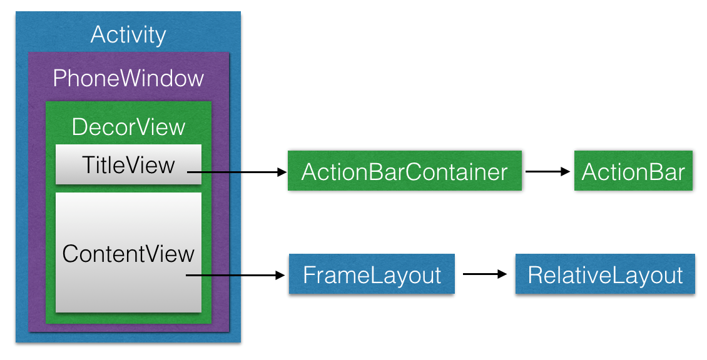

##基础知识

###一 Touch事件的种类

讲到Touch事件的传递，这里面有就需要先讲到Touch事件有哪些。

	MotionEvent.ACTION_DOWN　：手指按下屏幕的瞬间（一切事件的开始）
	
	MotionEvent.ACTION_MOVE　：手指在屏幕上移动
	
	MotionEvent.ACTION_UP　：手指离开屏幕瞬间
	
	MotionEvent.ACTION_CANCEL 　：取消手势，一般由程序产生，不会由用户产生

一般来说就是如上3种，这里我们暂时只讨论单个手指的问题。

###一 Touch事件传递基本流程梳理

说到Touch事件的传递，那么需要讲到3个方法：

	bool dispatchTouchEvent(MotionEvent ev)
	bool onInterceptTouchEvent(MotionEvent ev)
	bool onTouchEvent(MotionEvent ev)

其中，第二个方法View没有，ViewGroup才有。

3个方法在传递的过程中调用如下。

其实整个调用是一个递归的过程，上图中的虚线框，代表了dispatchTouchEvent方法，所以可以看出，onInterceptTouchEvent以及onTouchEvent都是在dispatchTouchEvent方法中执行的，而父容器的
dispatchTouchEvent方法，又会调用子控件的dispatchTouchEvent方法，从而形成了一种递归调用。

递归调用，是事件往下传递的方式，那么事件的消费又是如何处理的呢？并且，事件往往不是单一的，有down必然有up，也可能还有move，哪些view又会收到cancel，这些问题都需要一一讨论。

为了简化过程，这里，我们先来讨论down的情况，如果产生了一个down事件，那么它会如何传递并消费呢？

onInterceptTouchEvent这里先不讨论，先简单理清楚整个逻辑，假设事件可以直接从外向内直接传递到最里面的子view。

用户手指的按下，伴随着一个down事件的产生，down事件最开始由最大的父容器接收，随后，开始递归传递给子控件。

直到传递到view为止，由于view并不包含子控件，所以，view就是传递的终点，我们知道onTouchEvent是在dispatchTouchEvent方法中调用的，那么在最后的view里面，就会调用onTouchEvent，从上面的方法声明可以看到，该方法返回一个bool值，这个值，有什么作用呢，其实，他的作用就是反应该view是否消费了这个down事件。

返回true，代表消费了，那么dispatchTouchEvent也会返回true，从而告诉上层的view事件已经被子控件消费，也就没有必要调用父view的onTouchEvent方法了，也就递归终止，直接回到最上层。

返回false，代表没有消费，那么dispatchTouchEvent也会返回false，从而告诉上层，view的事件没有被子控件消费，此时，该view的上层父控件就会调用他自己的onTouchEvent来帮他儿子背锅，看看自己是否需要这个事件，如果，自己也不需要，那么他的dispatchTouchEvent也会返回false，从而去询问再上一层的控件，执行onTouchEvent，以此类推。直到最上层，最后由activity的onTouchEvent来背锅。

----以上讨论的是没有onInterceptTouchEvent执行的情况下，也就是说，父容器并不会拦截事件，简化的流程更加易于理解，如果加上这个方法，那么整个流程需要有一些改变。再加上事件的产生，不会只产生一个事件，down事件的产生，后续必然伴随其他事件，那么他们之间的传递是否又有不同，这只能通过源码来查看。

###二 源码分析

先来看看view层级的关系图：

我们选择直接从touch事件被分发到view层次结构的根节点DecorView开始说起，代码如下：

	@Override
	    public boolean dispatchTouchEvent(MotionEvent ev) {
	        final Callback cb = getCallback(); // 和key事件类似，优先派发给Callback，否则直接交给view层次结构处理
	        return cb != null && !isDestroyed() && mFeatureId < 0 ? cb.dispatchTouchEvent(ev)
	                : super.dispatchTouchEvent(ev);
	    }

Callback接口的实现一般是Activity或Dialog，这里我们看看Activity的实现：

	/**
	     * Called to process touch screen events.  You can override this to
	     * intercept all touch screen events before they are dispatched to the
	     * window.  Be sure to call this implementation for touch screen events
	     * that should be handled normally.
	     * 
	     * @param ev The touch screen event.
	     * 
	     * @return boolean Return true if this event was consumed.
	     */
	    public boolean dispatchTouchEvent(MotionEvent ev) {
	        if (ev.getAction() == MotionEvent.ACTION_DOWN) {
	            onUserInteraction(); // 一开始down事件的时候，调用此callback
	        }
	        if (getWindow().superDispatchTouchEvent(ev)) { // 交给了此Activity关联的window处理，实际是派发到view层次结构中
	            return true; // 如果被window处理掉了（消费了）则返回true，
	        }
	        return onTouchEvent(ev); // 否则调用Activity自己的onTouchEvent进行最后的处理
	    }

紧接着，我们看看交给window处理的逻辑，这里我们不绕弯了，直接看最终调用到的代码：

@Override
    public boolean superDispatchTouchEvent(MotionEvent event) {
        return mDecor.superDispatchTouchEvent(event); // window直接交给了DecorView处理
    }

    public boolean superDispatchTouchEvent(MotionEvent event) {
        return super.dispatchTouchEvent(event); // DecorView直接交给了其super，即ViewGroup处理
    }

接下来ViewGroup对touch事件的处理才是重中之重，不过在看容器类对touch事件处理之前，我觉得有必要先来看看单一的View类

对touch事件的处理，毕竟简单些，而且ViewGroup自身也依赖这些实现，代码如下：

		/**
		     * Pass the touch screen motion event down to the target view, or this
		     * view if it is the target.
		     *
		     * @param event The motion event to be dispatched.
		     * @return True if the event was handled by the view, false otherwise.
		     */
		    public boolean dispatchTouchEvent(MotionEvent event) {
		        if (mInputEventConsistencyVerifier != null) {
		            mInputEventConsistencyVerifier.onTouchEvent(event, 0);
		        }
		
		        if (onFilterTouchEventForSecurity(event)) { // 一般都成立
		            //noinspection SimplifiableIfStatement
		            ListenerInfo li = mListenerInfo;
		            if (li != null && li.mOnTouchListener != null && (mViewFlags & ENABLED_MASK) == ENABLED
		                    && li.mOnTouchListener.onTouch(this, event)) { // 先在ENABLED状态下尝试调用onTouch方法
		                return true; // 如果被onTouch处理了，则直接返回true
		            }
		            // 从这里我们可以看出，当你既设置了OnTouchListener又设置了OnClickListener，那么当前者返回true的时候，
		            // onTouchEvent没机会被调用，当然你的OnClickListener也就不会被触发；另外还有个区别就是onTouch里可以
		            // 收到每次touch事件，而onClickListener只是在up事件到来时触发。
		            if (onTouchEvent(event)) {
		                return true;
		            }
		        }
		
		        if (mInputEventConsistencyVerifier != null) {
		            mInputEventConsistencyVerifier.onUnhandledEvent(event, 0);
		        }
		        return false; // 上面的都没处理，则返回false
		    }
		
		    /**
		     * Implement this method to handle touch screen motion events.
		     * 

		     * If this method is used to detect click actions, it is recommended that
		     * the actions be performed by implementing and calling
		     * {@link #performClick()}. This will ensure consistent system behavior,
		     * including:
		     * <ul>
		     * <li>obeying click sound preferences
		     * <li>dispatching OnClickListener calls
		     * <li>handling {@link AccessibilityNodeInfo#ACTION_CLICK ACTION_CLICK} when
		     * accessibility features are enabled
		     * </ul>
		     *
		     * @param event The motion event.
		     * @return True if the event was handled, false otherwise.
		     */
		    public boolean onTouchEvent(MotionEvent event) { // View对touch事件的默认处理逻辑
		        final int viewFlags = mViewFlags;
		
		        if ((viewFlags & ENABLED_MASK) == DISABLED) { // DISABLED的状态下
		            if (event.getAction() == MotionEvent.ACTION_UP && (mPrivateFlags & PFLAG_PRESSED) != 0) {
		                setPressed(false); // 复原，如果之前是PRESSED状态
		            }
		            // A disabled view that is clickable still consumes the touch
		            // events, it just doesn't respond to them.
		            return (((viewFlags & CLICKABLE) == CLICKABLE || // CLICKABLE或LONG_CLICKABLE的view标记为对事件处理了，
		                    (viewFlags & LONG_CLICKABLE) == LONG_CLICKABLE)); // 只不过是以do nothing的方式处理了。
		        }
		
		        if (mTouchDelegate != null) {
		            if (mTouchDelegate.onTouchEvent(event)) { // 如果有TouchDelegate的话，优先交给它处理
		                return true; // 处理了返回true，否则接着往下走
		            }
		        }
		
		        if (((viewFlags & CLICKABLE) == CLICKABLE || // View能对touch事件响应的前提要么是CLICKABLE要么是LONG_CLICKABLE
		                (viewFlags & LONG_CLICKABLE) == LONG_CLICKABLE)) {
		            switch (event.getAction()) {
		                case MotionEvent.ACTION_UP: // UP事件
		                    // 如果外围有可以滚动的parent的话，当按下时会设置这个标志位
		                    boolean prepressed = (mPrivateFlags & PFLAG_PREPRESSED) != 0;
		                    if ((mPrivateFlags & PFLAG_PRESSED) != 0 || prepressed) { // 按下了或者预按下了
		                        // take focus if we don't have it already and we should in
		                        // touch mode.
		                        boolean focusTaken = false;
		                        // 这行代码就是我们上篇博客中说的，设置了FocusableInTouchMode后，View在点击的时候就会
		                        // 尝试requestFocus()，并将focusToken设置为true
		                        if (isFocusable() && isFocusableInTouchMode() && !isFocused()) {
		                            focusTaken = requestFocus(); // 能进来这个if，一般都会返回true
		                        }
		
		                        if (prepressed) {
		                            // The button is being released before we actually
		                            // showed it as pressed.  Make it show the pressed
		                            // state now (before scheduling the click) to ensure
		                            // the user sees it.
		                            // 在前面down事件的时候我们延迟显示view的pressed状态
		                            setPressed(true); // 直到up事件到来的时候才显示pressed状态
		                       }
		
		                        if (!mHasPerformedLongPress) { // 如果没有长按发生的话
		                            // This is a tap, so remove the longpress check
		                            removeLongPressCallback(); // 移除长按callback
		
		                            // Only perform take click actions if we were in the pressed state
		                            if (!focusTaken) { // 看到没，focusTaken是false才会进入下面的if语句
		                                // Use a Runnable and post this rather than calling
		                                // performClick directly. This lets other visual state
		                                // of the view update before click actions start.
		　　　　　　　　　　　　            // 也就是说在touch mode下，不take focus的view第一次点击的时候才会触发onClick事件
		                                if (mPerformClick == null) {
		                                    mPerformClick = new PerformClick();
		                                }
		                                if (!post(mPerformClick)) { // 如果post失败了，则直接调用performClick()方法
		                                    performClick(); // 这2行代码会触发onClickListener
		                                }
		                            }
		                        }
		
		                        if (mUnsetPressedState == null) {
		                            mUnsetPressedState = new UnsetPressedState(); // unset按下状态的
		                        }
		
		                        if (prepressed) { 
		                            postDelayed(mUnsetPressedState,
		                                    ViewConfiguration.getPressedStateDuration());
		                        } else if (!post(mUnsetPressedState)) {
		                            // If the post failed, unpress right now
		                            mUnsetPressedState.run();
		                        }
		                        removeTapCallback();
		                    }
		                    break;
		
		                case MotionEvent.ACTION_DOWN: // DOWN事件
		                    mHasPerformedLongPress = false;
		
		                    if (performButtonActionOnTouchDown(event)) {
		                        break;
		                    }
		
		                    // Walk up the hierarchy to determine if we're inside a scrolling container.
		                    boolean isInScrollingContainer = isInScrollingContainer();
		
		                    // For views inside a scrolling container, delay the pressed feedback for
		                    // a short period in case this is a scroll.
		                    if (isInScrollingContainer) { // 如果是在可以滚动的container里面的话
		                        mPrivateFlags |= PFLAG_PREPRESSED; // 设置PREPRESSED标志位
		                        if (mPendingCheckForTap == null) {
		                            mPendingCheckForTap = new CheckForTap();
		                        } // 延迟pressed feedback
		                        postDelayed(mPendingCheckForTap, ViewConfiguration.getTapTimeout());
		                    } else {
		                        // Not inside a scrolling container, so show the feedback right away
		                        setPressed(true); // 否则直接显示pressed feedback
		                        checkForLongClick(0); // 并启动长按监测
		                    }
		                    break;
		
		                case MotionEvent.ACTION_CANCEL: // 针对CANCEL事件的话，恢复各种状态，移除各种callback
		                    setPressed(false);
		                    removeTapCallback();
		                    removeLongPressCallback();
		                    break;
		
		                case MotionEvent.ACTION_MOVE: // MOVE事件
		                    final int x = (int) event.getX();
		                    final int y = (int) event.getY();
		
		                    // Be lenient about moving outside of buttons
		                    if (!pointInView(x, y, mTouchSlop)) { // 如果移动到view的边界之外了，
		                        // Outside button
		                        removeTapCallback(); // 则取消Tap callback，这样当你松手的时候onClick不会被触发
		                        if ((mPrivateFlags & PFLAG_PRESSED) != 0) { // 当已经是按下状态的话
		                            // Remove any future long press/tap checks
		                            removeLongPressCallback(); // 移除长按callback
		
		                            setPressed(false); // 恢复按下状态
		                        }
		                    }
		                    break;
		            }
		            return true; // 最后返回true，表示对touch事件处理过了，消费了
		        }
		
		        return false; // 既不能单击也不能长按的View，返回false，表示不处理touch事件
		    }
	
	在开始介绍ViewGroup对touch事件的处理之前，我们还得先看看ViewGroup的一个内部类TouchTarget，因为它描述的就是被
	
	touch的view和touch的手指相关的信息，代码如下：
	
	/* Describes a touched view and the ids of the pointers that it has captured.
	     *
	     * This code assumes that pointer ids are always in the range 0..31 such that
	     * it can use a bitfield to track which pointer ids are present.
	     * As it happens, the lower layers of the input dispatch pipeline also use the
	     * same trick so the assumption should be safe here...
	     */
	    private static final class TouchTarget {
	        private static final int MAX_RECYCLED = 32;
	        private static final Object sRecycleLock = new Object[0];
	        private static TouchTarget sRecycleBin; // 回收再利用的链表头
	        private static int sRecycledCount;
	
	        public static final int ALL_POINTER_IDS = -1; // all ones
	
	        // The touched child view.
	        public View child;
	
	        // The combined bit mask of pointer ids for all pointers captured by the target.
	        public int pointerIdBits;
	
	        // The next target in the target list.
	        public TouchTarget next;
	
	        private TouchTarget() {
	        }
	
	        // 看到这个有没有很眼熟？是的Message里也有类似的实现，我们在之前介绍Message的文章里详细地分析过
	        public static TouchTarget obtain(View child, int pointerIdBits) {
	            final TouchTarget target;
	            synchronized (sRecycleLock) {
	                if (sRecycleBin == null) { // 没有可以回收的目标，则new一个返回
	                    target = new TouchTarget(); 
	                } else {
	                    target = sRecycleBin; // 重用当前的sRecycleBin
	                    sRecycleBin = target.next; // 更新sRecycleBin指向下一个
	                     sRecycledCount--; // 重用了一个，可回收的减1
	                    target.next = null; // 切断next指向
	                }
	            }
	            target.child = child; // 找到合适的target后，赋值
	            target.pointerIdBits = pointerIdBits;
	            return target;
	        }
	
	        public void recycle() { // 基本是obtain的反向过程
	            synchronized (sRecycleLock) {
	                if (sRecycledCount < MAX_RECYCLED) {
	                    next = sRecycleBin; // next指向旧的可回收的头
	                    sRecycleBin = this; // update旧的头指向this，表示它自己现在是可回收的target（第一个）
	                    sRecycledCount += 1; // 多了一个可回收的
	                } else {
	                    next = null; // 没有next了
	                }
	                child = null; // 清空child字段
	            }
	        }
	    }

理解了TouchTarget，现在是时候直面ViewGroup的dispatchTouchEvent()方法了，代码如下：

	@Override
	    public boolean dispatchTouchEvent(MotionEvent ev) {
	        if (mInputEventConsistencyVerifier != null) {
	            mInputEventConsistencyVerifier.onTouchEvent(ev, 1);
	        }
	
	        boolean handled = false;
	        if (onFilterTouchEventForSecurity(ev)) { // view没有被遮罩，一般都成立
	            final int action = ev.getAction();
	            final int actionMasked = action & MotionEvent.ACTION_MASK;
	
	            // Handle an initial down.
	            if (actionMasked == MotionEvent.ACTION_DOWN) { // 一堆touch事件（从按下到松手）中的第一个down事件
	                // Throw away all previous state when starting a new touch gesture.
	                // The framework may have dropped the up or cancel event for the previous gesture
	                // due to an app switch, ANR, or some other state change.
	                cancelAndClearTouchTargets(ev);
	                resetTouchState(); // 作为新一轮的开始，reset所有相关的状态
	            }
	
	            // Check for interception.
	            final boolean intercepted; // 检查是否要拦截
	            if (actionMasked == MotionEvent.ACTION_DOWN // down事件
	                    || mFirstTouchTarget != null) { // 或者之前的某次事件已经经由此ViewGroup派发给children后被处理掉了
	                final boolean disallowIntercept = (mGroupFlags & FLAG_DISALLOW_INTERCEPT) != 0;
	                if (!disallowIntercept) { // 只有允许拦截才执行onInterceptTouchEvent方法
	                    intercepted = onInterceptTouchEvent(ev); // 默认返回false，不拦截
	                    ev.setAction(action); // restore action in case it was changed
	                } else {
	                    intercepted = false; // 不允许拦截的话，直接设为false
	                }
	            } else {
	                // There are no touch targets and this action is not an initial down
	                // so this view group continues to intercept touches.
	                // 在这种情况下，actionMasked != ACTION_DOWN && mFirstTouchTarget == null
	                // 第一次的down事件没有被此ViewGroup的children处理掉（要么是它们自己不处理，要么是ViewGroup从一
	                // 开始的down事件就开始拦截），则接下来的所有事件
	                // 也没它们的份，即不处理down事件的话，那表示你对后面接下来的事件也不感兴趣
	                intercepted = true; // 这种情况下设置ViewGroup拦截接下来的事件
	            }
	
	            // Check for cancelation.
	            final boolean canceled = resetCancelNextUpFlag(this)
	                    || actionMasked == MotionEvent.ACTION_CANCEL; // 此touch事件是否取消了
	
	            // Update list of touch targets for pointer down, if needed.
	            // 是否拆分事件，3.0(包括)之后引入的，默认拆分
	            final boolean split = (mGroupFlags & FLAG_SPLIT_MOTION_EVENTS) != 0;
	            TouchTarget newTouchTarget = null; // 接下来ViewGroup判断要将此touch事件交给谁处理
	            boolean alreadyDispatchedToNewTouchTarget = false;
	            if (!canceled && !intercepted) { // 没取消也不拦截，即是个有效的touch事件
	                if (actionMasked == MotionEvent.ACTION_DOWN // 第一个手指down
	                        || (split && actionMasked == MotionEvent.ACTION_POINTER_DOWN) // 接下来的手指down
	                        || actionMasked == MotionEvent.ACTION_HOVER_MOVE) {
	                    final int actionIndex = ev.getActionIndex(); // always 0 for down
	                    final int idBitsToAssign = split ? 1 << ev.getPointerId(actionIndex)
	                            : TouchTarget.ALL_POINTER_IDS;
	
	                    // Clean up earlier touch targets for this pointer id in case they
	                    // have become out of sync.
	                    removePointersFromTouchTargets(idBitsToAssign);
	
	                    final int childrenCount = mChildrenCount;
	                    if (newTouchTarget == null && childrenCount != 0) { // 基本都成立
	                        final float x = ev.getX(actionIndex);
	                        final float y = ev.getY(actionIndex);
	                        // Find a child that can receive the event.
	                        // Scan children from front to back.
	                        final View[] children = mChildren;
	
	                        final boolean customOrder = isChildrenDrawingOrderEnabled();
	                        // 从最后一个向第一个找
	                        for (int i = childrenCount - 1; i >= 0; i--) {
	                            final int childIndex = customOrder ?
	                                    getChildDrawingOrder(childrenCount, i) : i;
	                            final View child = children[childIndex];
	                            if (!canViewReceivePointerEvents(child)
	                                    || !isTransformedTouchPointInView(x, y, child, null)) {
	                                continue; // 不满足这2个条件直接跳过，看下一个child
	                            }
	                            
	                            // child view能receive touch事件而且touch坐标也在view边界内
	
	                            newTouchTarget = getTouchTarget(child);// 查找child对应的TouchTarget
	                            if (newTouchTarget != null) { // 比如在同一个child上按下了多跟手指
	                                // Child is already receiving touch within its bounds.
	                                // Give it the new pointer in addition to the ones it is handling.
	                                newTouchTarget.pointerIdBits |= idBitsToAssign;
	                                break; // newTouchTarget已经有了，跳出for循环
	                            }
	
	                            resetCancelNextUpFlag(child);
	                            // 将此事件交给child处理
	                            // 有这种情况，一个手指按在了child1上，另一个手指按在了child2上，以此类推
	                            // 这样TouchTarget的链就形成了
	                            if (dispatchTransformedTouchEvent(ev, false, child, idBitsToAssign)) {
	                                // Child wants to receive touch within its bounds.
	                                mLastTouchDownTime = ev.getDownTime();
	                                mLastTouchDownIndex = childIndex;
	                                mLastTouchDownX = ev.getX();
	                                mLastTouchDownY = ev.getY();
	                                // 如果处理掉了的话，将此child添加到touch链的头部
	                                // 注意这个方法内部会更新 mFirstTouchTarget
	                                newTouchTarget = addTouchTarget(child, idBitsToAssign);
	                                alreadyDispatchedToNewTouchTarget = true; // down或pointer_down事件已经被处理了
	                                break; // 可以退出for循环了。。。
	                            }
	                        }
	                    }
	
	                    // 本次没找到newTouchTarget但之前的mFirstTouchTarget已经有了
	                    if (newTouchTarget == null && mFirstTouchTarget != null) {
	                        // Did not find a child to receive the event.
	                        // Assign the pointer to the least recently added target.
	                        newTouchTarget = mFirstTouchTarget;
	                        while (newTouchTarget.next != null) {
	                            newTouchTarget = newTouchTarget.next;
	                        }
	                        // while结束后，newTouchTarget指向了最初的TouchTarget
	                        newTouchTarget.pointerIdBits |= idBitsToAssign;
	                    }
	                }
	            }
	            // 非down事件直接从这里开始处理，不会走上面的一大堆寻找TouchTarget的逻辑
	            // Dispatch to touch targets.
	            if (mFirstTouchTarget == null) {
	                // 没有children处理则派发给自己处理
	                // No touch targets so treat this as an ordinary view.
	                handled = dispatchTransformedTouchEvent(ev, canceled, null,
	                        TouchTarget.ALL_POINTER_IDS);
	            } else {
	                // Dispatch to touch targets, excluding the new touch target if we already
	                // dispatched to it.  Cancel touch targets if necessary.
	                TouchTarget predecessor = null;
	                TouchTarget target = mFirstTouchTarget;
	                while (target != null) { // 遍历TouchTarget形成的链表
	                    final TouchTarget next = target.next;
	                    if (alreadyDispatchedToNewTouchTarget && target == newTouchTarget) {
	                        handled = true; // 已经处理过的不再让其处理事件
	                    } else {
	                        // 取消child标记
	                        final boolean cancelChild = resetCancelNextUpFlag(target.child)
	                                || intercepted;
	                        // 如果ViewGroup从半路拦截了touch事件则给touch链上的child发送cancel事件
	                        // 如果cancelChild为true的话
	                        if (dispatchTransformedTouchEvent(ev, cancelChild,
	                                target.child, target.pointerIdBits)) {
	                            handled = true; // TouchTarget链中任意一个处理了则设置handled为true
	                        }
	                        if (cancelChild) { // 如果是cancelChild的话，则回收此target节点
	                            if (predecessor == null) {
	                                mFirstTouchTarget = next;
	                            } else {
	                                predecessor.next = next; // 相当于从链表中删除一个节点
	                            }
	                            target.recycle(); // 回收它
	                            target = next;
	                            continue;
	                        }
	                    }
	                    predecessor = target; // 访问下一个节点
	                    target = next;
	                }
	            }
	
	            // Update list of touch targets for pointer up or cancel, if needed.
	            if (canceled
	                    || actionMasked == MotionEvent.ACTION_UP
	                    || actionMasked == MotionEvent.ACTION_HOVER_MOVE) {
	                // 取消或up事件时resetTouchState
	                resetTouchState();
	            } else if (split && actionMasked == MotionEvent.ACTION_POINTER_UP) {
	                // 当某个手指抬起时，将其相关的信息移除
	                final int actionIndex = ev.getActionIndex();
	                final int idBitsToRemove = 1 << ev.getPointerId(actionIndex);
	                removePointersFromTouchTargets(idBitsToRemove);
	            }
	        }
	
	        if (!handled && mInputEventConsistencyVerifier != null) {
	            mInputEventConsistencyVerifier.onUnhandledEvent(ev, 1);
	        }
	        return handled; // 返回处理的结果
	    }

拦截方法默认返回false：

    public boolean onInterceptTouchEvent(MotionEvent ev) {
        return false; // 其默认直接返回false，表示不拦截
    }

当递归调用一层层向上返回的时候，如果view层次结构没有处理某个touch事件则最终交给了Activity.onTouchEvent方法，这里

我们一并看下：

	/**
	     * Called when a touch screen event was not handled by any of the views
	     * under it.  This is most useful to process touch events that happen
	     * outside of your window bounds, where there is no view to receive it.
	     * 
	     * @param event The touch screen event being processed.
	     * 
	     * @return Return true if you have consumed the event, false if you haven't.
	     * The default implementation always returns false.
	     */
	    public boolean onTouchEvent(MotionEvent event) { // 没啥需要多说的，好好看方法doc吧
	        if (mWindow.shouldCloseOnTouch(this, event)) {
	            finish();
	            return true;
	        }
	        
	        return false;
	    }

###三 规则提炼

 Android的Touch事件处理分3个层面：Activity层，ViewGroup层，View层。

首先说一下Touch事件处理的几条基本规则。

  1.如果在某个层级没有处理ACTION_DOWN事件，那么该层就再也收不到后续的Touch事件了直到下一次ACTION_DOWN事件。

 说明：
   a.某个层级没有处理某个事件指的是它以及它的子View都没有处理该事件。

   b.这条规则不适用于Activity层（它是顶层），它们可以收到每一个Touch事件。

   c.如果没有处理ACTION_MOVE这类事件，不会有任何影响。

  2.如果ACTION_DOWN事件发生在某个View的范围之内，则后续的ACTION_MOVE，ACTION_UP和ACTION_CANCEL等事件都将被发往该View，即使事件已经出界了。

  3.第一根按下的手指触发ACTION_DOWN事件，之后按下的手指触发ACTION_POINTER_DOWN事件，中间起来的手指触发ACTION_POINTER_UP事件，最后起来的手指触发ACTION_UP事件（即使它不是触发ACTION_DOWN事件的那根手指）。

  4.pointer id可以用于跟踪手指，从按下的那个时刻起pointer id生效，直至起来的那一刻失效，这之间维持不变。

  5.如果一个ACTION_DOWN事件被父View拦截了，则任何子View不会再收到任何Touch事件了（这符合第1点的要求）。

  6.如果一个非ACTION_DOWN事件被父View拦截了，则那些上次处理了ACTION_DOWN事件的子View会收到一个ACTION_CANCEL事件，之后不会再收到任何Touch事件了，即使父View不再拦截后续的Touch事件。

  7.如果父View决定处理Touch事件或者子View没有处理Touch事件，则父View按照普通View的处理方式处理Touch事件，否则它根本不处理Touch事件（它只负责分发）。

  8.如果父View在onInterceptTouchEvent中拦截了事件，则onInterceptTouchEvent中不会再收到Touch事件了，事件被直接交给它自己处理（按照普通View的处理方式）。

  9.如果view设置了OnTouchListener，并且OnTouchListener消费了touch事件，那么onTouchEvent方法不会再执行，由于click是在ontouchevent中执行，所以click事件也无法执行。

  10.TouchDelegate可以用来扩大子view的实际触控范围，从而在绘制面积不变的情况下，使得触控面积发生改变

