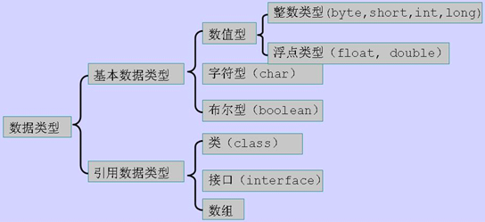
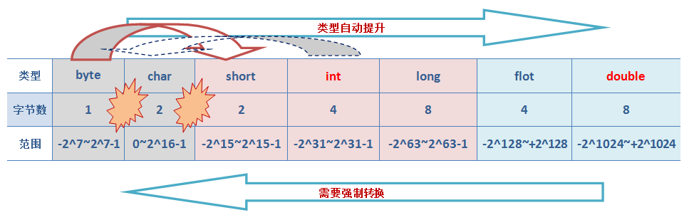

## java语言结构、语法规则

[TOC]

------

### 语言结构

java语言的源码是由一个或多个编译单元（compilation unit）组成的，每个编译单元只能包含以下内容：

1. 一个程序包语句（package statement）
2. 若干导入语句（import statement）
3. 类的声明（class declarations）
4. 接口声明（interface declarations）

```
package xxx.xxx.xxx;		//程序包语句	

import xxx.xxx.xxx;			//导入包
...

public class 类名1 {		   //类声明
	//属性定义;
	...
	
	//方法定义
	方法名(){
      //方法体
	}
	...
}
class 类名2{
  ...
}
```

------

### 语言规则

#### 关键字

是被java赋予了特殊含义的单词

关键字列表：

| [abstract](http://baike.baidu.com/view/122814.htm) | [assert](http://baike.baidu.com/view/653925.htm) | [boolean](http://baike.baidu.com/view/1229867.htm) | break                                    | [byte](http://baike.baidu.com/view/44243.htm) |
| ---------------------------------------- | ---------------------------------------- | ---------------------------------------- | ---------------------------------------- | ---------------------------------------- |
| case                                     | [catch](http://baike.baidu.com/view/1908899.htm) | [char](http://baike.baidu.com/view/1006519.htm) | [class](http://baike.baidu.com/view/76711.htm) | const                                    |
| continue                                 | [default](http://baike.baidu.com/view/1109945.htm) | [do](http://baike.baidu.com/view/126968.htm) | [double](http://baike.baidu.com/view/860124.htm) | [else](http://baike.baidu.com/view/2249891.htm) |
| [enum](http://baike.baidu.com/view/827326.htm) | [extends](http://baike.baidu.com/view/745501.htm) | [final](http://baike.baidu.com/view/2116821.htm) | [finally](http://baike.baidu.com/view/137061.htm) | float                                    |
| [for](http://baike.baidu.com/view/124948.htm) | goto                                     | [if](http://baike.baidu.com/view/127156.htm) | [implements](http://baike.baidu.com/view/2424683.htm) | [import](http://baike.baidu.com/view/2117022.htm) |
| [instanceof](http://baike.baidu.com/view/1989052.htm) | [int](http://baike.baidu.com/view/804413.htm) | [interface](http://baike.baidu.com/view/334756.htm) | long                                     | native                                   |
| new                                      | [package](http://baike.baidu.com/view/1006568.htm) | [private](http://baike.baidu.com/view/51615.htm) | [protected](http://baike.baidu.com/view/833512.htm) | [public](http://baike.baidu.com/view/1022383.htm) |
| [return](http://baike.baidu.com/view/1350512.htm) | [strictfp](http://baike.baidu.com/view/1866622.htm) | [short](http://baike.baidu.com/view/981206.htm) | [static](http://baike.baidu.com/view/536145.htm) | [super](http://baike.baidu.com/view/496937.htm) |
| [switch](http://baike.baidu.com/view/600161.htm) | [synchronized](http://baike.baidu.com/view/1207212.htm) | [this](http://baike.baidu.com/view/626297.htm) | [throw](http://baike.baidu.com/view/3019126.htm) | [throws](http://baike.baidu.com/item/throws) |
| [transient](http://baike.baidu.com/view/1698173.htm) | try                                      | [void](http://baike.baidu.com/view/1004734.htm) | [volatile](http://baike.baidu.com/view/608706.htm) | [while](http://baike.baidu.com/view/1455003.htm) |

关键字大致含义：

| **关键字**      | **含义**                                   |
| ------------ | ---------------------------------------- |
| abstract     | 表明类或者成员方法具有抽象属性                          |
| assert       | 用来进行程序调试                                 |
| boolean      | 基本数据类型之一，布尔类型                            |
| break        | 提前跳出一个块                                  |
| byte         | 基本数据类型之一，字节类型                            |
| case         | 用在switch语句之中，表示其中的一个分支                   |
| catch        | 用在异常处理中，用来捕捉异常                           |
| char         | 基本数据类型之一，字符类型                            |
| class        | 类                                        |
| const        | 保留关键字，没有具体含义                             |
| continue     | 回到一个块的开始处                                |
| default      | 默认，例如，用在switch语句中，表明一个默认的分支              |
| do           | 用在do-while循环结构中                          |
| double       | 基本数据类型之一，双精度浮点数类型                        |
| else         | 用在条件语句中，表明当条件不成立时的分支                     |
| enum         | 枚举                                       |
| extends      | 表明一个类型是另一个类型的子类型，这里常见的类型有类和接口            |
| final        | 用来说明最终属性，表明一个类不能派生出子类，或者成员方法不能被覆盖，或者成员域的值不能被改变 |
| finally      | 用于处理异常情况，用来声明一个基本肯定会被执行到的语句块             |
| float        | 基本数据类型之一，单精度浮点数类型                        |
| for          | 一种循环结构的引导词                               |
| goto         | 保留关键字，没有具体含义                             |
| if           | 条件语句的引导词                                 |
| implements   | 表明一个类实现了给定的接口                            |
| import       | 表明要访问指定的类或包                              |
| instanceof   | 用来测试一个对象是否是指定类型的实例对象                     |
| int          | 基本数据类型之一，整数类型                            |
| interface    | 接口                                       |
| long         | 基本数据类型之一，长整数类型                           |
| native       | 用来声明一个方法是由与计算机相关的语言（如C/C++/FORTRAN语言）实现的 |
| new          | 用来创建新实例对象                                |
| null         | 用来标识一个不确定的对象                             |
| package      | 包                                        |
| private      | 一种访问控制方式：私用模式                            |
| protected    | 一种访问控制方式：保护模式                            |
| public       | 一种访问控制方式：共用模式                            |
| return       | 从成员方法中返回数据                               |
| short        | 基本数据类型之一,短整数类型                           |
| static       | 表明具有静态属性                                 |
| strictfp     | 用来声明FP_strict（单精度或双精度浮点数）表达式遵循IEEE 754算术规范 |
| super        | 表明当前对象的父类型的引用或者父类型的构造方法                  |
| switch       | 分支语句结构的引导词                               |
| synchronized | 表明一段代码需要同步执行                             |
| this         | 指向当前实例对象的引用                              |
| throw        | 抛出一个异常                                   |
| throws       | 声明在当前定义的成员方法中所有需要抛出的异常                   |
| transient    | 声明不用序列化的成员域                              |
| try          | 尝试一个可能抛出异常的程序块                           |
| void         | 声明当前成员方法没有返回值                            |
| volatile     | 表明两个或者多个变量必须同步地发生变化                      |
| while        | 用在循环结构中                                  |

注意：

​	*1)main不是关键字，但是它是java程序默认的入口，因此也不可被用作其他用途*

​	*2)在写java程序时，一个java文件中只能存在一个公共类，也就是一个.java文件中只能有一个类被pulbic修饰*


------

#### 标识符

在程序中自定义的一些名称（类，方法，变量，常量等的名称）

可由数字、字母、_、$组成。

​	1）不能以数字开头；

        2）不能使用关键字和保留字；如main，goto等。

        3）java严格区分大小写。最好不要使用大小写的不同来区别不同的标示符，容易出现混乱。

java命名约定：

​	1)包名：多单词组成时所有字母都小写。如： xxxyyyzzz
​	2)类名接口名：多单词组成时，所有单词的首字母大写。如： XxxYyyZzz
​	3)变量名和函数名：多单词组成时，第一个单词首字母小写，第二个单词开始每个单词首字母大写。如：		xxxYyyZzz
​	4)常量名：所有字母都大写。多单词时每个单词用下划线连接。如： XXX_YYY


------

#### 数据类型

##### 数据类型分类

在java源代码中，每个变量都必须声明一种类型（type）。有两种类型：primitive type和reference type。引用类型引用对象（reference to object），而基本类型直接包含值（directly contain value）。因此，Java数据类型（type）可以分为两大类：基本类型（primitive types）和引用类型（reference types）。primitive types 包括boolean类型以及数值类型（numeric types）。numeric types又分为整型（integer types）和浮点型（floating-point type）。整型有5种：byte short int long char(char本质上是一种特殊的int)。浮点类型有float和double。关系整理一下如下图：




注意：

​	*1）整数默认：int，浮点数默认：double*

​	*2）java语言中同一种数据类型在任何平台上占据的内存长度都是相同的。*

​	*3）java语言的每种数据类型都对应着一个缺省值*

**数据类型占用长度**

java程序中，所有的基本数据类型的长度是是一定的：

| 类型           | 字节   | 表示范围                                     | 包装类      |
| ------------ | ---- | ---------------------------------------- | -------- |
| byte(字节型)    | 1    | -128~127                                 | Byte     |
| short(短整型)   | 2    | -32768～32767                             | Short    |
| int(整型)      | 4    | -2147483648～2147483647                   | Integer  |
| long(长整型)    | 8    | -9223372036854775808 ~ 9223372036854775807 | Long     |
| float(浮点型)   | 4    | -3.4E38～3.4E38                           | Float    |
| double(双精度型) | 8    | -1.7E308～1.7E308                         | Double   |
| char(字符型)    | 2    | 从字符型对应的整型数来划分，其表示范围是0～65535              | Charater |
| booealn(布尔型) | 1    | true或false                               | Boolean  |

**对象占用内存情况**

主要是参考了[这篇很久以前的文章](http://www.jroller.com/maxim/entry/again_about_determining_size_of)，不过试验了一把，instrumentation这种方法还是靠谱的。

```
import java.lang.instrument.Instrumentation;  
import java.lang.reflect.Array;  
import java.lang.reflect.Field;  
import java.lang.reflect.Modifier;  
import java.util.ArrayDeque;  
import java.util.Deque;  
import java.util.HashSet;  
import java.util.Set;  

/** 
* 对象占用字节大小工具类 
* 
* @author tianmai.fh 
* @date 2014-03-18 11:29 
*/  
public class SizeOfObject {  
    static Instrumentation inst;  
 
    public static void premain(String args, Instrumentation instP) {  
        inst = instP;  
    }  
   
    /** 
     * 直接计算当前对象占用空间大小，包括当前类及超类的基本类型实例字段大小、<br></br> 
     * 引用类型实例字段引用大小、实例基本类型数组总占用空间、实例引用类型数组引用本身占用空间大小;
     * 但是不包括超类继承下来的和当前类声明的实例引用字段的对象本身的大小、实例引用数组引用的对象本身的大小 
     * 
     * @param obj 
     * @return 
     */  
     public static long sizeOf(Object obj) {  
         return inst.getObjectSize(obj);  
     }  
 
    /** 
     * 递归计算当前对象占用空间总大小，包括当前类和超类的实例字段大小以及实例字段引用对象大小 
     * 
     * @param objP 
     * @return 
     * @throws IllegalAccessException 
     */  
     public static long fullSizeOf(Object objP) throws IllegalAccessException {  
         Set<Object> visited = new HashSet<Object>();  
        Deque<Object> toBeQueue = new ArrayDeque<>();  
         toBeQueue.add(objP);  
        long size = 0L;  
         while (toBeQueue.size() > 0) {  
             Object obj = toBeQueue.poll();  
             //sizeOf的时候已经计基本类型和引用的长度，包括数组  
            size += skipObject(visited, obj) ? 0L : sizeOf(obj);  
             Class<?> tmpObjClass = obj.getClass();  
            if (tmpObjClass.isArray()) {  
                //[I , [F 基本类型名字长度是2  
                 if (tmpObjClass.getName().length() > 2) {  
                    for (int i = 0, len = Array.getLength(obj); i < len; i++) {  
                       Object tmp = Array.get(obj, i);  
                         if (tmp != null) {  
                           //非基本类型需要深度遍历其对象  
                            toBeQueue.add(Array.get(obj, i));  
                        }  
                    }  
                }  
             } else {  
                while (tmpObjClass != null) {  
                    Field[] fields = tmpObjClass.getDeclaredFields();  
                    for (Field field : fields) {  
                        if (Modifier.isStatic(field.getModifiers())   //静态不计  
                        	|| field.getType().isPrimitive()) {    //基本类型不重复计  
                            continue;  
                        }  
  
                        field.setAccessible(true);  
                        Object fieldValue = field.get(obj);  
                        if (fieldValue == null) {  
                            continue;  
                      }  
                        toBeQueue.add(fieldValue);  
                   }  
                     tmpObjClass = tmpObjClass.getSuperclass();  
                }  
            }  
        }  
        return size;  
    }  
  
    /** 
     * String.intern的对象不计；计算过的不计，也避免死循环 
     * 
     * @param visited 
     * @param obj 
     * @return 
     */  
    static boolean skipObject(Set<Object> visited, Object obj) {  
        if (obj instanceof String && obj == ((String) obj).intern()) {  
            return true;  
        }  
        return visited.contains(obj);  
    }  
}  
```

       跑代码前，需要按照那篇很老的文章先打包，这样才能注入Instrumentation实例，打包时候需要在MANIFEST.MF中写入三项值（注意包路径名改成自己的包名）：

```
Premain-class: xxx.yyy.zzz.SizeOfObject  
Can-Redefine-Classes: false  
Boot-Class-Path:   
```

        来看看测试类：

```
import java.io.File;  

import static com.tmall.buy.structure.SizeOfObject.*;  
/** 
 * @author tianmai.fh 
 * @date 2014-03-18 20:17 
 */  
public class SizeOfObjectTest {  
    /** 
     * -XX:+UseCompressedOops: mark/4 + metedata/8 + 4 = 16 
     * -XX:-UseCompressedOops: mark/8 + metedata/8 + 4 + padding/4 = 24 
     */  
    static class A {  
        int a;  
    }  
  
    /** 
     * -XX:+UseCompressedOops: mark/4 + metedata/8 + 4 + 4 + padding/4 = 24 
     * -XX:-UseCompressedOops: mark/8 + metedata/8 + 4 + 4 = 24 
     */  
    static class B {  
        int a;  
        int b;  
    }  
   
    /** 
     * -XX:+UseCompressedOops: mark/4 + metedata/8 + 4 + 4 + padding/4 = 24 
     * -XX:-UseCompressedOops: mark/8 + metedata/8 + 8 + 4 + padding/4 = 32 
     */  
    static class B2 {  
        int b2a;  
        Integer b2b;  
    }  
  
    /** 
     * 不考虑对象头： 
     * 4 + 4 + 4 * 3 + 3 * sizeOf(B) 
     */  
    static class C extends A {  
        int ba;  
        B[] as = new B[3];  
  
        C() {  
            for (int i = 0; i < as.length; i++) {  
                as[i] = new B();  
            }  
        }  
    }  
  
    static class D extends B {  
        int da;  
        Integer[] di = new Integer[3];  
    }  
  
    /** 
     * 会算上A的实例字段 
     */  
    static class E extends A {  
        int ea;  
        int eb;  
    }  
  
    public static void main(String[] args) throws IllegalAccessException {  
        System.out.println(new File("./target/classes").getAbsolutePath());  
        System.out.println("sizeOf(new Object())=" + sizeOf(new Object()));  
        System.out.println("sizeOf(new A())=" + sizeOf(new A()));  
        System.out.println("sizeOf(new B())=" + sizeOf(new B()));  
        System.out.println("sizeOf(new B2())=" + sizeOf(new B2()));  
        System.out.println("sizeOf(new B[3])=" + sizeOf(new B[3]));  
        System.out.println("sizeOf(new C())=" + sizeOf(new C()));  
        System.out.println("fullSizeOf(new C())=" + fullSizeOf(new C()));  
        System.out.println("sizeOf(new D())=" + sizeOf(new D()));  
        System.out.println("fullSizeOf(new D())=" + fullSizeOf(new D()));  
        System.out.println("sizeOf(new int[3])=" + sizeOf(new int[3]));  
        System.out.println("sizeOf(new Integer(1)=" + sizeOf(new Integer(1)));  
        System.out.println("sizeOf(new Integer[0])=" + sizeOf(new Integer[0]));  
        System.out.println("sizeOf(new Integer[1])=" + sizeOf(new Integer[1]));  
        System.out.println("sizeOf(new Integer[2])=" + sizeOf(new Integer[2]));  
        System.out.println("sizeOf(new Integer[3])=" + sizeOf(new Integer[3]));  
        System.out.println("sizeOf(new Integer[4])=" + sizeOf(new Integer[4]));  
        System.out.println("sizeOf(new A[3])=" + sizeOf(new A[3]));  
        System.out.println("sizeOf(new E())=" + sizeOf(new E()));  
    }  
}  

```


         如果你是用maven打包的话，可以考虑[在pom.xml文件中配置](http://yueyemaitian.iteye.com/blog/2032856)。打完jar包后，可以直接运行SizeOfObject了，但是要加上vm启动参数（test.jar是刚才打的jar包）：

-javaagent:target/test.jar   

         在我64bit mac上，跑64位hotspot vm的结果如下，其中压缩对象指针参数是开启的，即-XX:+UseCompressedOops

```
sizeOf(new Object())=16  
sizeOf(new A())=16  
sizeOf(new B())=24  
sizeOf(new B2())=24  
sizeOf(new B[3])=32  
sizeOf(new C())=24  
fullSizeOf(new C())=128  
sizeOf(new D())=32  
fullSizeOf(new D())=64  
sizeOf(new int[3])=32  
sizeOf(new Integer(1)=16  
sizeOf(new Integer[0])=16  
sizeOf(new Integer[1])=24  
sizeOf(new Integer[2])=24  
sizeOf(new Integer[3])=32  
sizeOf(new Integer[4])=32  
sizeOf(new A[3])=32  
sizeOf(new E())=24  

```


         如果关闭指针压缩，即在vm启动参数中加上-XX:-UseCompressedOops结果会不一样：

```
1. sizeOf(new Object())=16  
2. sizeOf(new A())=24  
3. sizeOf(new B())=24  
4. sizeOf(new B2())=32  
5. sizeOf(new B[3])=48  
6. sizeOf(new C())=40  
7. fullSizeOf(new C())=160  
8. sizeOf(new D())=40  
9. fullSizeOf(new D())=88  
10. sizeOf(new int[3])=40  
11. sizeOf(new Integer(1)=24  
12. sizeOf(new Integer[0])=24  
13. sizeOf(new Integer[1])=32  
14. sizeOf(new Integer[2])=40  
15. sizeOf(new Integer[3])=48  
16. sizeOf(new Integer[4])=56  
17. sizeOf(new A[3])=48  
18. sizeOf(new E())=32  
```

         UseCompressOops开启和关闭，对对象头大小是有影响的，开启压缩，对象头是4+8=12byte；关闭压缩，对象头是8+8=16bytes。这个如何观察验证呢？

        基于上述事实，通过new A()和new B()占用字节推断，基本类型int在开启、关闭压缩情况下都是占用4个bytes的，这个没有影响。而通过B和B2在开启、关闭指针压缩情况下的对比看，Integer类型分别占了4 bytes和8 bytes，实际上引用类型都是这样。


**对象头**

对象头在32位系统上占用8bytes，64位系统上占用16bytes。


**实例数据**

原生类型(primitive type)的内存占用如下：

| Primitive Type | Memory Required(bytes) |
| -------------- | ---------------------- |
| boolean        | 1                      |
| byte           | 1                      |
| short          | 2                      |
| char           | 2                      |
| int            | 4                      |
| float          | 4                      |
| long           | 8                      |
| double         | 8                      |

reference类型在32位系统上每个占用4bytes, 在64位系统上每个占用8bytes。

**对齐补充**

HotSpot的对齐方式为8字节对齐：

> （对象头 + 实例数据 + padding） % 8等于0且0 <= padding < 8

**指针压缩**

对象占用的内存大小收到VM参数**UseCompressedOops**的影响。

**1）对对象头的影响**

开启（-XX:+UseCompressedOops）对象头大小为12bytes（64位机器）。

```
static class A {
        int a;
    }
```

A对象占用内存情况：

关闭指针压缩： 16+4=20不是8的倍数，所以+padding/4=24


开启指针压缩： 12+4=16已经是8的倍数了，不需要再padding。


**2） 对reference类型的影响**

64位机器上reference类型占用8个字节，开启指针压缩后占用4个字节。

```
static class B2 {
        int b2a;
        Integer b2b;
}
```

B2对象占用内存情况：

关闭指针压缩： 16+4+8=28不是8的倍数，所以+padding/4=32


开启指针压缩： 12+4+4=20不是8的倍数，所以+padding/4=24


**数组对象**

64位机器上，数组对象的对象头占用24个字节，启用压缩之后占用16个字节。之所以比普通对象占用内存多是因为需要额外的空间存储数组的长度。

先考虑下new Integer[0]占用的内存大小，长度为0，即是对象头的大小：

未开启压缩：24bytes


开启压缩后：16bytes


接着计算new Integer[1]，new Integer[2]，new Integer[3]和new Integer[4]就很容易了：

未开启压缩：


开启压缩：


拿new Integer[3]来具体解释下：

未开启压缩：24（对象头）+8*3=48，不需要padding；

开启压缩：16（对象头）+3*4=28，+padding/4=32，其他依次类推。

自定义类的数组也是一样的，比如：

```
static class B3 {
        int a;
        Integer b;
    }
```

new B3[3]占用的内存大小：

未开启压缩：48

开启压缩后：32

**复合对象**

计算复合对象占用内存的大小其实就是运用上面几条规则，只是麻烦点。

**1）对象本身的大小**

直接计算当前对象占用空间大小，包括当前类及超类的基本类型实例字段大小、引用类型实例字段引用大小、实例基本类型数组总占用空间、实例引用类型数组引用本身占用空间大小; 但是不包括超类继承下来的和当前类声明的实例引用字段的对象本身的大小、实例引用数组引用的对象本身的大小。

```
static class B {
        int a;
        int b;
    }
static class C {
        int ba;
        B[] as = new B[3];

        C() {
            for (int i = 0; i < as.length; i++) {
                as[i] = new B();
            }
        }
    }
```

未开启压缩：16（对象头）+4（ba）+8（as引用的大小）+padding/4=32

开启压缩：12+4+4+padding/4=24

**2)当前对象占用的空间总大小**

递归计算当前对象占用空间总大小，包括当前类和超类的实例字段大小以及实例字段引用对象大小。

递归计算复合对象占用的内存的时候需要注意的是：对齐填充是以每个对象为单位进行的，看下面这个图就很容易明白。


现在我们来手动计算下C对象占用的全部内存是多少，主要是三部分构成：C对象本身的大小+数组对象的大小+B对象的大小。

未开启压缩：

(16 + 4 + 8+4(padding)) + (24+ 8*3) +(16+8)*3 = 152bytes

开启压缩：

(12 + 4 + 4 +4(padding)) + (16 + 4*3 +4(数组对象padding)) + (12+8+4（B对象padding）)*3= 128bytes


------

##### 常量

“常量”在程序运行时，不会被修改的量。换言之，常量虽然是为了硬件、软件、编程语言服务，但是它并不是因为硬件、软件、编程语言而引入。

```
Java 常量，有2种意思，我分别说明：
第1种意思，就是一个值，这个值本身，我们可以叫它常量，举几个例子：
整型常量: 123
实型常量：3.14
字符常量: 'a'
逻辑常量：true、false
字符串常量："helloworld

还有另一种：
第2种意思，表示不可变的变量，这种也叫常量，从语法上来讲也就是，加上final，使用final关键字来修饰某个变量，然后只要赋值之后，就不能改变了，就不能再次被赋值了，据个例子：
final int i = 0;
那么这个i的值是绝对不能再被更改了，只能是0，所以说是 不可变的变量，这句话看似矛盾，其实不矛盾，这句话这样理解：
i就是一个int类型的变量，变量本身是可变的（可被更改值），但是现在加了final，所以不可变了，所以是不可变的变量。
```


------

##### 变量

变量就是在程序运行中值可变的量（本身代表保持数据的内存单元）。在使用变量前需要先定义

在Java中，所有的变量必须先声明才能使用它们。变量声明的基本形式如下：

```
type identifier [ = value][, identifier [= value] ...] ;
```

 type 是Java 的数据类型之一。该标识符是该变量的名称。申报指定类型的多个变量，用逗号分隔的列表。

下面是各种类型的变量声明的几个例子。需要注意的是它们可能也包括初始化。

```
int a, b, c;         // declares three ints, a, b, and c.
int d = 3, e, f = 5; // declares three more ints, initializing
                     // d and f.
byte z = 22;         // initializes z.
double pi = 3.14159; // declares an approximation of pi.
char x = 'x';        // the variable x has the value 'x'.
```

本章将解释各种变量类型Java语言提供。有三种类型的变量在Java中：

- 局部变量
- 实例变量
- 类/静态变量

**局部变量：**

- 局部变量的方法，构造函数或块中声明。
- 创建局部变量的方法，构造函数或块时进入，一旦退出方法，构造函数或块中的变量将被销毁。
- 访问修饰符不能用于局部变量。
- 局部变量是可见的，只有内声明的方法，构造函数或块。
- 局部变量在堆栈级别内部实现。
- 在这里对局部变量没有默认值，因此局部变量应该声明和初始值应在第一次使用前分配。

**实例：**

在这里，age 是一个局部变量。这是定义里面 pupAge()  方法，其范围仅限于该方法。

```
public class Test{ 
   public void pupAge(){
      int age = 0;
      age = age + 7;
      System.out.println("Puppy age is : " + age);
   }
   
   public static void main(String args[]){
      Test test = new Test();
      test.pupAge();
   }
}
```

这将产生以下结果：

```
Puppy age is: 7

```


下面的示例使用 age 没有初始化它，所以它会在编译时给出错误信息。

```
public class Test{ 
   public void pupAge(){
      int age;
      age = age + 7;
      System.out.println("Puppy age is : " + age);
   }
   
   public static void main(String args[]){
      Test test = new Test();
      test.pupAge();
   }
}
```

编译它，这将产生以下错误：

```
Test.java:4:variable number might not have been initialized
age = age + 7;
         ^
1 error

```

**实例变量：**

- 实例变量在类中声明，但在方法的外面，构造函数或任何块。
- 当空间分配给某个对象在堆中，插槽为每个实例变量创建值。
- 实例变量认为必须由一个以上的方法，构造函数或块，或一个对象的状态的关键部分必须出现在整个类中引用的值。
- 实例变量可以在使用前或后级的级别声明。
- 访问修饰符可以给出实例变量。
- 实例变量对于所有方法，构造函数和块在类中可见。通常，建议，使这些变量私有（接入层）。然而能见度子类可以给这些变量与使用访问修饰符。
- 实例变量有默认值。对于数字的默认值是0，为布尔值是false和对象引用为null。值可以在声明或构造函数中分配。
- 实例变量可以直接通过调用变量名的类的内部访问。然而在静态方法和不同的类（当实例变量被赋予访问）应使用完全限定名调用 ObjectReference.VariableName.

**例子：**

```
import java.io.*;

public class Employee{
   // this instance variable is visible for any child class.
   public String name;
   
   // salary  variable is visible in Employee class only.
   private double salary;
   
   // The name variable is assigned in the constructor. 
   public Employee (String empName){
      name = empName;
   }

   // The salary variable is assigned a value.
   public void setSalary(double empSal){
      salary = empSal;
   }
   
   // This method prints the employee details.
   public void printEmp(){
      System.out.println("name  : " + name );
      System.out.println("salary :" + salary);
   }

   public static void main(String args[]){
      Employee empOne = new Employee("Ransika");
      empOne.setSalary(1000);
      empOne.printEmp();
   }
}
```

这将产生以下结果:

```
name  : Ransika
salary :1000.0

```

**类/静态变量：**

- 类变量也称为静态变量在类的static关键字声明的，但在方法外面，构造函数或块。
- 每个类变量只有一个副本，不管有多少对象从它被创建。
- 静态变量很少使用不是被声明为常量等。常量是被声明为公共/私营，最终和静态变量。常量变量从来没有从他们的初始值改变。
- 静态变量被存储在静态存储器中。这是罕见的使用静态变量以外声明为final，用作公共或私有常数。
- 在程序启动时的静态变量被创建，在程序停止销毁。
- 能见度类似于实例变量。然而，大多数静态变量声明为 public，因为它们必须可用于类的使用者。
- 默认值是相同的实例变量。对于数字，默认值是0;为布尔值，它是假的，和对象引用，它为null。值可以在声明或构造函数中分配。另外值可以在特殊的静态初始化块进行分配。
- 静态变量可以通过调用与类名来访问。 ClassName.VariableName.
- 当定义的变量为 public static final ，那么变量的名称（常量）都是大写。如果静态变量是不公开的和最终的命名语法是相同的实例变量和局部变量。

**例子：**

```
import java.io.*;

public class Employee{
   // salary  variable is a private static variable
   private static double salary;

   // DEPARTMENT is a constant
   public static final String DEPARTMENT = "Development ";

   public static void main(String args[]){
      salary = 1000;
      System.out.println(DEPARTMENT+"average salary:"+salary);
   }
}
```

这将产生以下结果:

```
Development average salary:1000

```

注意：如果变量是从外部类访问的常数应被访问 Employee.DEPARTMENT


------

#####  数据类型转换

**一、基本数据类型的类型转换**

基本数据类型中，布尔类型boolean占有一个字节，由于其本身所代码的特殊含义，**boolean类型与其他基本类型不能进行类型的转换（既不能进行自动类型的提升，也不能强制类型转换）， 否则，将编译出错**。

1.基本数据类型中数值类型的自动类型提升

数值类型在内存中直接存储其本身的值，对于不同的数值类型，内存中会分配相应的大小去存储。如:byte类型的变量占用8位，int类型变量占用32位等。相应的，不同的数值类型会有与其存储空间相匹配的取值范围。具体如下所示：



图中依次表示了各数值类型的字节数和相应的取值范围。**在Java中，整数类型（byte/short/int/long）中，对于未声明数据类型的整形，其默认类型为int型。在浮点类型（float/double）中，对于未声明数据类型的浮点型，默认为double型。**

接下来我们看看如下一个较为经典例子：

```
 1 package com.corn.testcast;
 2 
 3 
 4 public class TestCast {
 5     
 6     public static void main(String[] args) {
 7         byte a = 1000;   // 编译出错 Type mismatch: cannot convert from int to byte
 8         float b = 1.5;   // 编译出错 Type mismatch: cannot convert from double to float
 9         byte c = 3;      // 编译正确
10     }
11     
12 }
```

是不是有点奇怪？按照上面的思路去理解，将一个int型的1000赋给一个byte型的变量a，编译出错，提示"cannot convert from int to byte"是对的，1.5默认是一个double型，将一个double类型的值赋给一个float类型，编译出错，这也是对的。但是最后一句：将一个int型的3赋给一个byte型的变量c，居然编译正确，这是为什么呢？

原因在于：jvm在编译过程中，对于默认为int类型的数值时，当赋给一个比int型数值范围小的数值类型变量（在此统一称为数值类型k，k可以是byte/char/short类型），会进行判断，如果此int型数值超过数值类型k，那么会直接编译出错。因为你将一个超过了范围的数值赋给类型为k的变量，k装不下嘛，你有没有进行强制类型转换，当然报错了。但是如果此int型数值尚在数值类型k范围内，jvm会自定进行一次隐式类型转换，将此int型数值转换成类型k。如图中的虚线箭头。这一点有点特别，需要稍微注意下。

**在其他情况下，当将一个数值范围小的类型赋给一个数值范围大的数值型变量，jvm在编译过程中俊将此数值的类型进行了自动提升。在数值类型的自动类型提升过程中，数值精度至少不应该降低（整型保持不变，float->double精度将变高）。**

```
 1 package com.corn.testcast;
 2 
 3 public class TestCast {
 4 
 5     public static void main(String[] args) {
 6         long a = 10000000000; //编译出错: The literal 10000000000 of type int is out of range 
 7         long b = 10000000000L; //编译正确
 8         int c = 1000;
 9         long d = c;
10         float e = 1.5F;
11         double f = e;
12     }
13 
14 }
```

如上：定义long类型的a变量时，将编译出错，原因在于10000000000默认是int类型，同时int类型的数值范围是-2^31 ~ 2^31-1，因此，10000000000已经超过此范围内的最大值，故而其自身已经编译出错，更谈不上赋值给long型变量a了。

此时，若想正确赋值，改变10000000000自身默认的类型即可，直接改成10000000000L即可将其自身类型定义为long型。此时再赋值编译正确。

将值为1000的int型变量c赋值给long型变量d，按照上文所述，此时直接发生了自动类型提升， 编译正确。同理，将e赋给f编译正确。

接下来，还有一个地方需要注意的是：char型其本身是unsigned型，同时具有两个字节，其数值范围是0 ~ 2^16-1，因为，这直接导致**byte型不能自动类型提升到char，char和short直接也不会发生自动类型提升（因为负数的问题）**，同时，byte当然可以直接提升到short型。

 

2.基本数据类型中的数值类型强制转换

 当我们需要将数值范围较大的数值类型赋给数值范围较小的数值类型变量时，由于**此时可能会丢失精度**（1讲到的从int到k型的隐式转换除外），因此，需要人为进行转换。我们称之为强制类型转换。

首先我们看一下如下的例子：

```
 1 package com.corn.testcast;
 2 
 3 public class TestCast {
 4 
 5     public static void main(String[] args) {
 6         byte p = 3; // 编译正确:int到byte编译过程中发生隐式类型转换
 7         int  a = 3;
 8         byte b = a; // 编译出错：cannot convert from int to byte
 9         byte c = (byte) a; // 编译正确
10         float d = (float) 4.0;
11     }
12 
13 }
```


byte p =3；编译正确在1中已经进行了解释。接下来将一个值为3的int型变量a赋值给byte型变量b，发生编译错误。这两种写法之间有什么区别呢？

**区别在于前者3是直接量，编译期间可以直接进行判定，后者a为一变量，需要到运行期间才能确定，也就是说，编译期间为以防万一，当然不可能编译通过了。****此时，需要进行强制类型转换。**

强制类型转换所带来的结果是可能会丢失精度，如果此数值尚在范围较小的类型数值范围内，对于整型变量精度不变，但如果超出范围较小的类型数值范围内，很可能出现一些意外情况。

如下经典例子：

```
 1 package com.corn.testcast;
 2 
 3 public class TestCast {
 4 
 5     public static void main(String[] args) {
 6         int a = 233;
 7         byte b = (byte) a;
 8         System.out.println("b:" + b);  // 输出：-23
 9     }
10 
11 }
```

为什么结果是-23？需要从最根本的二进制存储考虑。

233的二进制表示为：24位0 + 11101001，byte型只有8位，于是从高位开始舍弃，截断后剩下：11101001，由于二进制最高位1表示负数，0表示正数，其相应的负数为-23。

 

3.进行数学运算时的数据类型自动提升与可能需要的强制类型转换

 如下代码：

```
 1 package com.corn.testcast;
 2 
 3 public class TestCast {
 4 
 5     public static void main(String[] args) {
 6         byte a = 3 + 5; // 编译正常 编译成 3+5直接变为8
 7         int b = 3, c = 5;
 8         byte d = b + c; // 编译错误：cannot convert from int to byte
 9 
10         byte e = 10, f = 11;
11         byte g = e + f; // 编译错误 +直接将10和11类型提升为了int
12         byte h = (byte) (e + f);  //编译正确
13     }
14 
15 }
```


**当进行数学运算时，数据类型会自动发生提升到运算符左右之较大者**，以此类推。当将最后的运算结果赋值给指定的数值类型时，可能需要进行强制类型转换。

**二、引用类型的类型转换/造型**

   编写java程序时，引用变量只能调用它编译时类型的方法，而不能调用它运行时类型的方法，即使它实际所引用对象确实包含该方法。

引用类型之间的转换只能把一个父类变量转换成子类类型。如果试图把一个父类实例转换成子类类型，则必须这个对象实际上是子类实例才行（即编译时类型为父类类型，运行时为子类类型），否则会发生ClassCastException异常。

```
public class Test {

     public static void main(String[] args) {

         Object o1=new Object();            //o1的编译类型是Object，实际类型是Object，是string的父类，所以可以强制转换成string类

         String o2=new String();             //o2的编译类型是String，实际类型是String

         Object o3=new String();            //o3的编译类型是Object，实际类型是String

         o2=(String)o1;                          //编译时没错，运行时有错(o2和o1的实际类型不一样)

        o2=(String)o3;                           //编译时没错，运行时没错（o2和o3的实际类型一样）

        o3=(String)o1;                          //编译时没错，运行时有错(o1和o3的实际类型不一样)

        o3=o1;                                     //编译时没错，运行时也没错

     }

}
```

    在强制转换之前可以先用instanceof来判断是否可以成功转换，instanceof 的前一个操作数通常是引用类型变量，后一个通常是类。它用于判断前面的对象是否是后面的类或其子类的实例，如果是返回true否则返回false。instanceof前面的操作数的编译类型要么与后面的类相同，要么是后面类的父类，否则会发生编译错误。

```
public class Test {

 public static void main(String[] args) {

   　 Object a1=new String();

 　　System.out.println(a1 instanceof Object);     　　//返回true

 　　System.out.println(a1 instanceof String);　　　　//返回true

 　　System.out.println(a1 instanceof Math);　　　　//返回false，math是object的子类

 　　System.out.println(a1 instanceof Comparable);　　//返回true，string实现了comparable接口

 　　String a2=new String();

　　 System.out.println(a2 instanceof Math );　　　　//编译错误因为a2不是math类，也不是math的父类

 }

}
```

------

#### 数据表现形式

进制也就是进位制，是人们规定的一种进位方法。 对于任何一种进制---X进制，就表示某一位置上的数运算时是逢X进一位。 十进制是逢十进一，[十六进制](http://baike.baidu.com/view/230306.htm)是逢十六进一，[二进制](http://baike.baidu.com/view/18536.htm)就是逢二进一，以此类推，x进制就是逢x进位。

我们人类在生活中使用的都是十进制，所以对于我们，十进制才是最好的数据表现形式。然而对计算机而言，数据的表示是使用二极管表示的，最好的表现形式显然是二进制。


##### 无符号整数

    在内存中，无符号整数的所有位都用来表示数值，以unsigned int 为例，此类型变量在内存中占4字节，8个十六进制数组成，取值范围为0x00000000~ 0xFFFFFFFF。

    无符号整型不足32位时，用0来填充剩余高位。对于x86架构，内存中以“小尾方式”，也称为“小端方式”存放，小尾方式的存放是以字节为单位，按照长度，低数据位排放在内存的低端，高数据位排放在内存的高端，如0x12345678将会存储为78 56 34 12，在其他计算机体系里，也有大尾方式，即低数据位存放在内存高端，高数据位存放在内存低端。0x12345678将会存储为12 34 56 78。

    无符号整型无正负之分，在内存中以真值形式存放。

 

##### 有符号整数

   有符号整数中用来表示符号的是最高位，最高位0表示正数，1表示负数。取值范围为0x80000000~0x7FFFFFFF。如果是十进制，表示范围为-2147483648 ~ 2147483647 。

   有符号整数中，正数的表示区间为：0x00000000~0x7FFFFFFF；负数的表示区间为：0x80000000 ~0xFFFFFFFF。

   有符号整数在内存中以补码形式存放，正数的补码等于真值，而负数的补码规则是用0减去这个数的绝对值，也可以表示为这个数取反加1，对于-3，可以表示为0-3，而0xFFFFFFFD+3等于0，所以-3的补码为0xFFFFFFFD,为了计算方便常用取反加一的方式求的补码，因为对于任何四字节数值，都有X+X(反) = 0xFFFFFFFF,于是X+X(反)+1 = 0，于是可以推导出0-x=x(反)+1。

   在数据分析中，如果将内存解释为有符号整数，则查看用十六进制数表示时的最高位，最高位小于8则为正数，大于8则为负数，如果是负数，需要转换为真值才能得到对应的负数数值


##### 浮点数

在讨论浮点数之前，先看一下整数在计算机内部是怎样表示的。

> **　　int num=9;**

上面这条命令，声明了一个整数变量，类型为int，值为9（二进制写法为1001）。普通的32位计算机，用4个字节表示int变量，所以9就被保存为00000000 00000000 00000000 00001001，写成16进制就是0x00000009。

那么，我们的问题就简化成：**为什么0x00000009还原成浮点数，就成了0.000000？**

下面一步一步的揭晓答案。

先来看一个公式，计算浮点数的公式：

根据国际标准IEEE 754，任意一个二进制浮点数V可以表示成下面的形式：

> 　　
>
> **　　（1）(-1)^s表示符号位，当s=0，V为正数；当s=1，V为负数。**
>
> **　　（2）M表示有效数字，大于等于1，小于2。**
>
> **　　（3）2^E表示指数位。**

举例来说，十进制的5.0，写成二进制是101.0，相当于1.01×2^2。那么，按照上面V的格式，可以得出s=0，M=1.01，E=2。

十进制的-5.0，写成二进制是-101.0，相当于-1.01×2^2。那么，s=1，M=1.01，E=2。

IEEE 754规定，对于32位的浮点数，最高的1位是符号位s，接着的8位是指数E，剩下的23位为有效数字M。


对于64位的浮点数，最高的1位是符号位S，接着的11位是指数E，剩下的52位为有效数字M。


IEEE 754对有效数字M和指数E，还有一些特别规定。

前面说过，1≤M<2，也就是说，M可以写成1.xxxxxx的形式，其中xxxxxx表示小数部分。**IEEE 754规定，在计算机内部保存M时，默认这个数的第一位总是1，因此可以被舍去，只保存后面的xxxxxx部分。**比如保存1.01的时候，只保存01，等到读取的时候，再把第一位的1加上去。这样做的目的，是节省1位有效数字。以32位浮点数为例，留给M只有23位，将第一位的1舍去以后，等于可以保存24位有效数字。

至于指数E，情况就比较复杂。

首先，E为一个无符号整数（unsigned int）。这意味着，如果E为8位，它的取值范围为0~255；如果E为11位，它的取值范围为0~2047。但是，我们知道，科学计数法中的E是可以出现负数的，**所以IEEE 754规定，E的真实值必须再减去一个中间数，对于8位的E，这个中间数是127；对于11位的E，这个中间数是1023。**

比如，2^10的E是10，所以保存成32位浮点数时，必须保存成10+127=137，即10001001。

然后，指数E还可以再分成三种情况：

**（1）E不全为0或不全为1。**这时，浮点数就采用上面的规则表示，即指数E的计算值减去127（或1023），得到真实值，再将有效数字M前加上第一位的1。

**（2）E全为0。**这时，浮点数的指数E等于1-127（或者1-1023），有效数字M不再加上第一位的1，而是还原为0.xxxxxx的小数。这样做是为了表示±0，以及接近于0的很小的数字。

**（3）E全为1。**这时，如果有效数字M全为0，表示±无穷大（正负取决于符号位s）；如果有效数字M不全为0，表示这个数不是一个数（NaN）。

下面，让我们回到一开始的问题：**为什么0x00000009还原成浮点数，就成了0.000000？**

首先，将0x00000009拆分，得到第一位符号位s=0，后面8位的指数E=00000000，最后23位的有效数字M=000 0000 0000 0000 0000 1001。

由于指数E全为0，所以符合上一节的第二种情况。因此，浮点数V就写成：

> 　　V=(-1)^0×0.00000000000000000001001×2^(-126)=1.001×2^(-146)

显然，V是一个很小的接近于0的正数，所以用十进制小数表示就是0.000000。


##### 原码, 反码, 补码 详解

在学习原码, 反码和补码之前, 需要先了解机器数和真值的概念.

**1、机器数**

一个数在计算机中的二进制表示形式,  叫做这个数的机器数。机器数是带符号的，在计算机用一个数的最高位存放符号, 正数为0, 负数为1.

比如，十进制中的数 +3 ，计算机字长为8位，转换成二进制就是00000011。如果是 -3 ，就是 10000011 。

那么，这里的 00000011 和 10000011 就是机器数。

**2、真值**

> 因为第一位是符号位，所以机器数的形式值就不等于真正的数值。例如上面的有符号数 10000011，其最高位1代表负，其真正数值是 -3 而不是形式值131（10000011转换成十进制等于131）。所以，为区别起见，将带符号位的机器数对应的真正数值称为机器数的真值。

例：0000 0001的真值 = +000 0001 = +1，1000 0001的真值 = –000 0001 = –1

 

**二. 原码, 反码, 补码的基础概念和计算方法.**

在探求为何机器要使用补码之前, 让我们先了解原码, 反码和补码的概念.对于一个数, 计算机要使用一定的编码方式进行存储. 原码, 反码, 补码是机器存储一个具体数字的编码方式.

1. **原码**

原码就是符号位加上真值的绝对值, 即用第一位表示符号, 其余位表示值. 比如如果是8位二进制:

> [+1]原 = 0000 0001
>
> [-1]原 = 1000 0001

第一位是符号位. 因为第一位是符号位, 所以8位二进制数的取值范围就是:

> [1111 1111 , 0111 1111]

即

> [-127 , 127]

原码是人脑最容易理解和计算的表示方式.

2. **反码**

反码的表示方法是:

正数的反码是其本身

负数的反码是在其原码的基础上, 符号位不变，其余各个位取反.

> [+1] = [00000001]原 = [00000001]反
>
> [-1] = [10000001]原 = [11111110]反

可见如果一个反码表示的是负数, 人脑无法直观的看出来它的数值. 通常要将其转换成原码再计算.

3. 补码

补码的表示方法是:

正数的补码就是其本身

负数的补码是在其原码的基础上, 符号位不变, 其余各位取反, 最后+1. (即在反码的基础上+1)

> [+1] = [00000001]原 = [00000001]反 = [00000001]补
>
> [-1] = [10000001]原 = [11111110]反 = [11111111]补

对于负数, 补码表示方式也是人脑无法直观看出其数值的. 通常也需要转换成原码在计算其数值.

 

**三. 为何要使用原码, 反码和补码**

在开始深入学习前, 我的学习建议是先"死记硬背"上面的原码, 反码和补码的表示方式以及计算方法.

现在我们知道了计算机可以有三种编码方式表示一个数. 对于正数因为三种编码方式的结果都相同:

> [+1] = [00000001]原 = [00000001]反 = [00000001]补

所以不需要过多解释. 但是对于负数:

> [-1] = [10000001]原 = [11111110]反 = [11111111]补

可见原码, 反码和补码是完全不同的. 既然原码才是被人脑直接识别并用于计算表示方式, 为何还会有反码和补码呢?

首先, 因为人脑可以知道第一位是符号位, 在计算的时候我们会根据符号位, 选择对真值区域的加减. (真值的概念在本文最开头). 但是对于计算机, 加减乘数已经是最基础的运算, 要设计的尽量简单. 计算机辨别"符号位"显然会让计算机的基础电路设计变得十分复杂! 于是人们想出了将符号位也参与运算的方法. 我们知道, 根据运算法则减去一个正数等于加上一个负数, 即: 1-1 = 1 + (-1) = 0 , 所以机器可以只有加法而没有减法, 这样计算机运算的设计就更简单了.

于是人们开始探索 将符号位参与运算, 并且只保留加法的方法. 首先来看原码:

计算十进制的表达式: 1-1=0

> 1 - 1 = 1 + (-1) = [00000001]原 + [10000001]原 = [10000010]原 = -2

如果用原码表示, 让符号位也参与计算, 显然对于减法来说, 结果是不正确的.这也就是为何计算机内部不使用原码表示一个数.

为了解决原码做减法的问题, 出现了反码:

计算十进制的表达式: 1-1=0

> 1 - 1 = 1 + (-1) = [0000 0001]原 + [1000 0001]原= [0000 0001]反 + [1111 1110]反 = [1111 1111]反 = [1000 0000]原 = -0

发现用反码计算减法, 结果的真值部分是正确的. 而唯一的问题其实就出现在"0"这个特殊的数值上. 虽然人们理解上+0和-0是一样的, 但是0带符号是没有任何意义的. 而且会有[0000 0000]原和[1000 0000]原两个编码表示0.

于是补码的出现, 解决了0的符号以及两个编码的问题:

> 1-1 = 1 + (-1) = [0000 0001]原 + [1000 0001]原 = [0000 0001]补 + [1111 1111]补 = [0000 0000]补=[0000 0000]原

这样0用[0000 0000]表示, 而以前出现问题的-0则不存在了.而且可以用[1000 0000]表示-128:

> (-1) + (-127) = [1000 0001]原 + [1111 1111]原 = [1111 1111]补 + [1000 0001]补 = [1000 0000]补

-1-127的结果应该是-128, 在用补码运算的结果中, [1000 0000]补 就是-128. 但是注意因为实际上是使用以前的-0的补码来表示-128, 所以-128并没有原码和反码表示.(对-128的补码表示[1000 0000]补算出来的原码是[0000 0000]原, 这是不正确的)

使用补码, 不仅仅修复了0的符号以及存在两个编码的问题, 而且还能够多表示一个最低数. 这就是为什么8位二进制, 使用原码或反码表示的范围为[-127, +127], 而使用补码表示的范围为[-128, 127].

因为机器使用补码, 所以对于编程中常用到的32位int类型, 可以表示范围是: [-231, 231-1] 因为第一位表示的是符号位.而使用补码表示时又可以多保存一个最小值.

 

**四 原码, 反码, 补码 再深入**

计算机巧妙地把符号位参与运算, 并且将减法变成了加法, 背后蕴含了怎样的数学原理呢?

将钟表想象成是一个1位的12进制数. 如果当前时间是6点, 我希望将时间设置成4点, 需要怎么做呢?我们可以:

> \1. 往回拨2个小时: 6 - 2 = 4
>
> \2. 往前拨10个小时: (6 + 10) mod 12 = 4
>
> \3. 往前拨10+12=22个小时: (6+22) mod 12 =4

2,3方法中的mod是指取模操作, 16 mod 12 =4 即用16除以12后的余数是4.

所以钟表往回拨(减法)的结果可以用往前拨(加法)替代!

现在的焦点就落在了如何用一个正数, 来替代一个负数. 上面的例子我们能感觉出来一些端倪, 发现一些规律. 但是数学是严谨的. 不能靠感觉.

首先介绍一个数学中相关的概念: 同余

 

**同余的概念**

两个整数a，b，若它们除以整数m所得的余数相等，则称a，b对于模m同余

记作 a ≡ b (mod m)

读作 a 与 b 关于模 m 同余。

举例说明:

> 4 mod 12 = 4
>
> 16 mod 12 = 4
>
> 28 mod 12 = 4

所以4, 16, 28关于模 12 同余.

 

**负数取模**

正数进行mod运算是很简单的. 但是负数呢?

下面是关于mod运算的数学定义:

[](http://images.cnblogs.com/cnblogs_com/zhangziqiu/201103/201103302155507894.jpg)

上面是截图, "取下界"符号找不到如何输入(word中粘贴过来后乱码). 下面是使用"L"和"J"替换上图的"取下界"符号:

> x mod y = x - y L x / y J

上面公式的意思是:

x mod y等于 x 减去 y 乘上 x与y的商的下界.

以 -3 mod 2 举例:

> -3 mod 2
>
> = -3 - 2xL -3/2 J
>
> = -3 - 2xL-1.5J
>
> = -3 - 2x(-2)
>
> = -3 + 4 = 1

所以:

> (-2) mod 12 = 12-2=10
>
> (-4) mod 12 = 12-4 = 8
>
> (-5) mod 12 = 12 - 5 = 7

 

**开始证明**

再回到时钟的问题上:

> 回拨2小时 = 前拨10小时
>
> 回拨4小时 = 前拨8小时
>
> 回拨5小时= 前拨7小时

注意, 这里发现的规律!

结合上面学到的同余的概念.实际上:

> (-2) mod 12 = 10
>
> 10 mod 12 = 10

-2与10是同余的.

> (-4) mod 12 = 8
>
> 8 mod 12 = 8

-4与8是同余的.

距离成功越来越近了. 要实现用正数替代负数, 只需要运用同余数的两个定理:

反身性:

> a ≡ a (mod m)

这个定理是很显而易见的.

线性运算定理:

> 如果a ≡ b (mod m)，c ≡ d (mod m) 那么:
>
> (1)a ± c ≡ b ± d (mod m)
>
> (2)a * c ≡ b * d (mod m)

如果想看这个定理的证明, 请看:[http://baike.baidu.com/view/79282.htm](http://baike.baidu.com/view/79282.htm)

所以:

> 7 ≡ 7 (mod 12)
>
> (-2) ≡ 10 (mod 12)
>
> 7 -2 ≡ 7 + 10 (mod 12)

现在我们为一个负数, 找到了它的正数同余数. 但是并不是7-2 = 7+10, 而是 7 -2 ≡ 7 + 10 (mod 12) , 即计算结果的余数相等.

接下来回到二进制的问题上, 看一下: 2-1=1的问题.

> 2-1=2+(-1) = [0000 0010]原 + [1000 0001]原= [0000 0010]反 + [1111 1110]反

先到这一步, -1的反码表示是1111 1110. 如果这里将[1111 1110]认为是原码, 则[1111 1110]原 = -126, 这里将符号位除去, 即认为是126.

发现有如下规律:

> (-1) mod 127 = 126
>
> 126 mod 127 = 126

即:

> (-1) ≡ 126 (mod 127)
>
> 2-1 ≡ 2+126 (mod 127)

2-1 与 2+126的余数结果是相同的! 而这个余数, 正式我们的期望的计算结果: 2-1=1

所以说一个数的反码, 实际上是这个数对于一个膜的同余数. 而这个膜并不是我们的二进制, 而是所能表示的最大值! 这就和钟表一样, 转了一圈后总能找到在可表示范围内的一个正确的数值!

而2+126很显然相当于钟表转过了一轮, 而因为符号位是参与计算的, 正好和溢出的最高位形成正确的运算结果.

既然反码可以将减法变成加法, 那么现在计算机使用的补码呢? 为什么在反码的基础上加1, 还能得到正确的结果?

> 2-1=2+(-1) = [0000 0010]原 + [1000 0001]原 = [0000 0010]补 + [1111 1111]补

如果把[1111 1111]当成原码, 去除符号位, 则:

> [0111 1111]原 = 127

其实, 在反码的基础上+1, 只是相当于增加了膜的值:

> (-1) mod 128 = 127
>
> 127 mod 128 = 127
>
> 2-1 ≡ 2+127 (mod 128)

此时, 表盘相当于每128个刻度转一轮. 所以用补码表示的运算结果最小值和最大值应该是[-128, 128].

但是由于0的特殊情况, 没有办法表示128, 所以补码的取值范围是[-128, 127]


#### 运算符

##### 运算符分类

1、算数运算符

| 运算符  | 运算    | 范例         | 结果      |
| ---- | ----- | ---------- | ------- |
| +    | 正号    | +3         | 3       |
| -    | 负号    | b=4，-b     | -4      |
| +    | 加     | 5+5        | 10      |
| -    | 减     | 6-4        | 2       |
| *    | 乘     | 2*2        | 4       |
| /    | 除     | 2/2        | 1       |
| %    | 取模    | 5%5        | 0       |
| ++   | 自增(前) | a=2，b=++a  | a=3,b=3 |
| ++   | 自增(后) | a=2，b=a++  | a=3,b=2 |
| --   | 自减(前) | a=2，b=--a  | a=1,b=1 |
| --   | 自减(后) | a=2，b=a--  | a=1,b=2 |
| +    | 字符串相加 | "He"+"llo" | "Hello" |

3、逻辑运算符

| 运算符  | 运算    | 范例            | 结果    |
| ---- | ----- | ------------- | ----- |
| &    | AND与  | false&true    | false |
| \|   | OR或   | false\|true   | true  |
| ^    | XOR异或 | false^true    | true  |
| !    | NOT非  | !true         | false |
| &&   | AND短路 | false&&true   | false |
| \|\| | OR短路  | false\|\|true | true  |

4、位运算符

| 位运算  | 运算    | 范例                             |
| ---- | ----- | ------------------------------ |
| <<   | 左移    | 3<<2=12         ------3*2*2=12 |
| >>   | 右移    | 3>>1=1            ------3/2=1  |
| >>>  | 无符号右移 | 3>>>1=1           ------3/2=1  |
| &    | 与运算   | 6&3=2                          |
| \|\| | 或运算   | 6\|3=7                         |
| ^    | 异或运算  | 6^3=5                          |
| ~    | 反码    | ~6=-7                          |


5、三元运算符 

格式：（条件表达式）?值1:值2 ; 

如果条件表达式结果为true，则运算后的结果是值1， 

如果条件表达式结果为flase，则运算后的结果是值2 ，


##### 运算符优先级

按[优先级](http://baike.baidu.com/view/1035789.htm)从高到低排列如下：[ ] ( ) ++ -- ! ～ instanceof * / % + - << >> >>> <> < = > \ == != &^& & || ? := op= 。

##### 类型转换

**强制和转换**

Java语言和[解释器](http://baike.baidu.com/view/592974.htm)限制使用强制和转换，以防止出错导致[系统崩溃](http://baike.baidu.com/view/765121.htm)。整数和浮点数[运算符](http://baike.baidu.com/view/425996.htm)间可以来回[强制转换](http://baike.baidu.com/view/965170.htm)，但整数不能强制转换成[数组](http://baike.baidu.com/view/209670.htm)或对象。对象不能被强制为基本类型。

Java中整数运算符在整数运算时，如果[操作数](http://baike.baidu.com/view/420846.htm)是long类型，则运算结果是long类型，否则为int类型，绝不会是byte，short或char型。这样，如果变量i被声明为short或byte，i+1的结果会是int。如果结果超过该类型的取值范围，则按该类型的最大值取模。

**运算符操作**

一、运算符"+"，如果必要则自动把[操作数](http://baike.baidu.com/view/420846.htm)转换为String型。如果操作数是一个对象，它可定义一个方法toString()返回该对象的String方式，例如floata=1.0print(“Thevalueofais”+a+“\n”);+[运算符](http://baike.baidu.com/view/425996.htm)用到的例子Strings=“a=”+a;+=运算符也可以用于String。注意，左边(下例中的s1)仅求值一次。s1+=a;//s1=s1+a//若a非String型，自动转换为String型。

二、整数算术运算的异常是由于除零或按零取模造成的。它将引发一个算术异常。下溢产生零，上溢导致越界。例如：加1超过整数最大值，取模后，变成最小值。一个op=[赋值运算符](http://baike.baidu.com/view/1589776.htm)，和上表中的各双目整数运算符联用，构成一个[表达式](http://baike.baidu.com/view/420676.htm)。整数关系运算符<，>，<=，>=，==和!=产生[boolean](http://baike.baidu.com/view/1229867.htm)类型的数据。

三、[数组](http://baike.baidu.com/view/209670.htm)[运算符](http://baike.baidu.com/view/425996.htm)数组运算符形式如下：<expression>[<expression>]可给出数组中某个元素的值。合法的取值范围是从0到数组的长度减1。

四、对象运算符[双目运算符](http://baike.baidu.com/view/3881180.htm)instanceof测试某个对象是否是指定类或其子类的实例。例如：if(myObjectinstanceofMyClass){MyClassanothermyObject=(MyClass)myObject;…}是判定myObject是否是MyClass的实例或是其子类的实例。

五、浮点[运算符](http://baike.baidu.com/view/425996.htm)浮点运算符可以使用常规运算符的组合：如[单目运算符](http://baike.baidu.com/view/4072122.htm)++、--，双目运算符+、-、*和/，以及[赋值运算符](http://baike.baidu.com/view/1589776.htm)+=，-=，*=，和/=。此外，还有[取模运算](http://baike.baidu.com/view/4887065.htm)：%和%=也可以作用于浮点数，例如：a%b和a-((int)(a/b)*b)的语义相同。这表示a%b的结果是除完后剩下的浮点数部分。只有单精度[操作数](http://baike.baidu.com/view/420846.htm)的浮点[表达式](http://baike.baidu.com/view/420676.htm)按照单精度运算求值，产生单精度结果。如果浮点表达式中含有一个或一个以上的双精度操作数，则按双精度运算，结果是[双精度浮点数](http://baike.baidu.com/view/2393520.htm)。

六、布尔[运算符](http://baike.baidu.com/view/425996.htm)布尔([boolean](http://baike.baidu.com/view/1229867.htm))变量或表达式的组合运算可以产生新的boolean值，fales和true(记得是小写)。单目运算符!是布尔非。双目运算符&，|和^是逻辑AND，OR和XOR运算符，它们强制两个操作数求布尔值。为避免右侧操作数冗余求值，用户可以使用[短路求值](http://baike.baidu.com/view/1083418.htm)运算符&&和||。

七、用户可以使用==和!=，[赋值运算符](http://baike.baidu.com/view/1589776.htm)也可以用&=、|=、^=。三元条件操作符和C语言中的一样。

八、++运算符用于表示直接加1操作。增量操作也可以用加运算符和赋值操作间接完成。++lvalue（[左值](http://baike.baidu.com/view/836474.htm)表示lvalue+=1,++lvalue也表示lvalue=lvalue+1。

九、--[运算符](http://baike.baidu.com/view/425996.htm)用于表示减1操作。++和--运算符既可以作为前缀运算符，也可以做为后缀运算符。双目整数运算符是：运算符操作**+加-减*乘/除%取模&位与|位或^位异或<<左移 >>右移(带符号) >>>添零右移整数除法按零舍入。除法和取模遵守以下等式：

```
(a/b)*b+(a%b)==a
```


